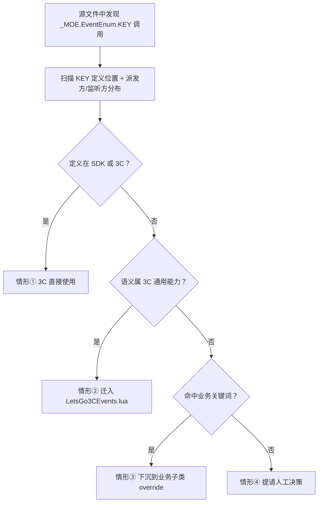

# Lua 代码迁移到 LetsGo3C（3C Lua Migration Skill）

> **定位**：本 Skill 是 Lua 代码搬迁到 LetsGo3C 的**唯一操作权威来源**，AI 执行 3C Lua 迁移时以本文件为准。
> **理念依据**：[refs/refactoring-philosophy-3c.md](./refs/refactoring-philosophy-3c.md)（七条铁律、四种去向、核心原则；3C 变体，母本为 `.cursor/rules/refactoring-philosophy.mdc`）

## 形态与同生态边界

| 场景 | 工具 | 形态 |
|------|------|------|
| Lua 代码搬入 **LetsGoSDK** | [.cursor/rules/lua-migration.mdc](../../../.cursor/rules/lua-migration.mdc) | Cursor Rule |
| Lua 代码搬入 **LetsGo3C**（本 Skill） | `ue-3c-lua-migration` | Cursor Skill |
| **资产**搬入 LetsGo3C（BP / 动画 / 贴图 等） | `ue-3c-asset-migration` | Cursor Skill |
| 3C 资产硬编码路径替换 | `ue-3c-asset-path-replace` | Cursor Skill |
| 3C 资产调整记录 | `ue-3c-asset-adjust-record` | Cursor Skill |

**关键边界**：本 Skill 只管 **.lua 文件**；与之配对的 BP/动画等资产请走 `ue-3c-asset-migration`。

## 触发条件

当用户提到以下关键词时，本 Skill 自动生效：
- 3C Lua 搬迁 / 3C 代码迁移 / 3C 脚本迁移
- 从 LetsGo 搬 Lua 到 LetsGo3C / 复制 LetsGo 的 Lua 文件到 LetsGo3C
- migrate lua to LetsGo3C / 3C lua migration
- 开始 3C Lua 搬迁 / 执行 3C Lua 搬迁

## 动手前：先读规范（必须）

**在执行任何迁移操作之前，必须先读取以下规范文件**（并行读取），确保理解完整流程后再动手：

### 必读文件

| 优先级 | 文件 | 内容 |
|--------|------|------|
| **P0** | **本文件**（`SKILL.md`） | 3C Lua 迁移操作的唯一权威来源 |
| **P0** | [`refs/refactoring-philosophy-3c.md`](./refs/refactoring-philosophy-3c.md) | 七条铁律、四种去向、核心原则（3C 专用变体，与 SDK 版共享 90%，差异集中在铁律六 + 职责-归属对照表） |
| **P0** | [`refs/todo-migration-format-3c.md`](./refs/todo-migration-format-3c.md) | TODO 标记规范（3C 专用变体，正式收录 6 种标签含 Subclass，user.json 路径已对齐 3C） |

**不要跳过这一步去翻 `Migration/AssetsMigration/` 下某个资产的历史调整文档当模板。** 规范文件 + 本 Skill 才是标准流程的权威来源。

---

## 执行流程（4 Phase）

```
1. 读取上述必读文件（并行）
2. 读取源文件 + 3C 同名候选位置 + 已有分析文档（并行）
3. 【Phase 1 分析】分析源文件 → 写入分析文档到文件 → 聊天里列出依赖项请求确认
4. 【⏸️ 人工决策点 1】等待开发人员逐个决策每个依赖搬不搬 → 将确认结果更新到分析文档
5. 【Phase 2 设计】基于确认结果做搬迁方案 → 写入搬迁计划文档到文件 → 聊天里请求确认
6. 【⏸️ 人工确认点 2】等待开发人员确认搬迁方案后，才能开始实施
7. 【Phase 3 实施】按确认后的方案执行实施（遵守三不原则）
8. 【Phase 4 验收】执行后处理操作 → 写入规范审查报告到文件
9. TODO 标记按 [refs/todo-migration-format-3c.md](./refs/todo-migration-format-3c.md) 格式（含 Subclass 第 6 种标签）
```

### 文档实时落地原则（铁律）

**文档是多人多次协作的载体，不是最后补的总结。** AI 无状态，换个对话/换个人只能从文件读取上下文。

**核心规则：先写文件，再请求确认。"输出到聊天" ≠ "生成文档"。**

每个阶段的产出必须**用工具写入文件**，然后在聊天里告知文件路径并请求确认：

| 阶段 | 产出物 | AI 动作 | 文件路径 |
|------|--------|---------|---------|
| Phase 1 分析 | 依赖列表 + 搬迁建议表 | **先 write_to_file**，再聊天请求确认 | `Content/LetsGo3C/Migration/LuaMigration/{模块}/Analysis/{源文件名}_分析文档.md` |
| ⏸️ 确认后 | 开发人员的决策结果 | **用 replace_in_file 更新**分析文档，标注每个依赖的确认结果 | 同上（更新） |
| Phase 2 设计 | 搬迁计划 | **先 write_to_file**，再聊天请求确认 | `Content/LetsGo3C/Migration/LuaMigration/{模块}/Plan/{源文件名}搬迁计划.md` |
| Phase 4 验收 | 规范审查报告 | **先 write_to_file** | `Content/LetsGo3C/Migration/LuaMigration/{模块}/Result/{目标文件名}搬迁规范审查.md` |

### 文档精简原则（铁律）

**文档长度应与源文件复杂度成正比，不能比源文件还长。**

| 原则 | 说明 |
|------|------|
| **不重复** | 分析文档已有的内容，搬迁计划不重复 |
| **不冗余** | 只写关键决策和任务清单，不写背景解释 |
| **少示例代码** | 只列修改要点，不贴大段演示代码 |
| **长度参考** | 搬迁计划行数 ≤ 源文件行数（除非依赖极复杂） |

**为什么这样做**：
- AI 无状态 → 下次对话从文件读上下文，聊天记录丢了也不影响
- 多人协作 → 新接手者打开 `Migration/LuaMigration/` 目录就能看到完整的 分析→确认→设计 链路
- Git 版本控制 → 文件跟代码一起走，不丢失

### 两个暂停点的区别

| 暂停点 | 阶段 | 目的 | AI 行为 |
|--------|------|------|---------|
| ⏸️ 人工决策点 1 | 分析→设计 | 开发人员决策：每个依赖搬不搬 | 写分析文档到文件 → 聊天列依赖项 → 等确认 → 更新文档 |
| ⏸️ 人工确认点 2 | 设计→实施 | 开发人员确认：整体方案可行再动手 | 写搬迁计划到文件 → 聊天请求确认 → 等确认 |

**关键规则**：这两个暂停点都是**硬性门禁**，AI 不得跳过任何一个直接进入下一阶段。

---

## Phase 1：分析阶段

### 基类性质识别（C++ 继承链分析 — 前置必做）

> **新规**（2026-05-18 后追加）：在做业务逻辑识别之前，**必须先判断当前 Lua 文件在 C++ + Lua 双层继承链里处于"基类 / 中层基类 / 业务子类"的哪个位置**。这个判断会直接决定后续的搬迁决策与虚方法设计，错判会得出南辕北辙的结论（如把"中层基类"误判为"业务子类"而放弃搬迁）。

#### 为什么需要看 C++

LetsGo 大多数 UE 组件类都是 **C++ UClass + Lua 子类 / 绑定** 的双层结构：
- C++ 一侧已经有完整的 `UMoeXxxBase` → `UMainXxx` → `UFeatureXxx`（玩法子类）继承链
- Lua 侧通过 `UE4.Class("路径...")` 显式声明其父类的 Lua 路径（亦或空参 `UE4.Class()`，依赖 C++ 侧继承）
- **仅看 Lua 路径名极易误判**：例如 `MainCharPropComponent.lua` 名字含 "Main"，但其实是 MainGame 模块的中层基类，向下有 10+ 个 C++/Lua 业务子类继承

#### 允许范围（白名单）

为完成基类性质识别，**允许 AI 读取以下 C++ 源码目录**：
- `Plugins/MOE/GameFramework/**`（引擎根基类层）
- `Plugins/MOE/GameFeatures/**`（玩法 Feature 模块的 C++ 类）
- `Plugins/MOE/GameCommon-Obsolete/**`（已废弃模块，参考用）
- 其他位于 `<工程根>/Plugins/**` 或 `<工程根>/Source/**` 下的 `.h` / `.cpp`

**只读不改**：基类识别阶段绝不修改任何 C++ 文件。如需修改 C++ 源码（如调整命名空间、改虚方法签名），属于另一类任务，需独立提请确认。

#### 项目策略：当前阶段不搬 C++（只搬 Lua）【硬性】

> **新规**（2026-05-19 后追加）：本 Skill 当前阶段**只搬 Lua 文件**，**不搬 C++ 源码**。

**"C++ 不搬"的精确含义**（关键澄清，避免误解）：

| ✅ 不动的 | ❌ 不等于不搬的 |
|---------|---------------|
| C++ `.h` / `.cpp` / `.generated.h` 文件 | Lua 父类文件（即使它"看起来"像 C++ 的伴随物） |
| C++ 类的 `IUnLuaInterface::GetModuleName_Implementation` 返回字符串 | Lua 父类文件的物理位置 |
| C++ UClass 名称、蓝图引用关系、模块 API 标记 | Lua 文件之间的 require 链 |

**关键事实：Lua 父类文件 ≠ C++ 的一部分**

很多形如 `MoeCharPropComponent.lua` 的"父类 Lua"其实是**纯 lua 类工厂**：
- 对应的 C++ 类（如 `UMoeCharPropComponent`）**通常没有实现 `IUnLuaInterface`**，C++ ↔ Lua 不直接绑定
- Lua 子类通过 `UE4.Class("父类 lua 路径")` 显式声明 lua 父类，本质就是 require 一个 lua 模块
- 因此 **Lua 父类可以独立搬到 3C 路径**，原 LetsGo 路径用透明转发桩兜底，子类 require 仍能拿到正确的 table，**C++ 完全零影响**

**反过来，必须留意的 C++ ↔ Lua 绑定情形**：
- 当前文件的 C++ 类如果实现了 `IUnLuaInterface::GetModuleName_Implementation`（如 `UMainCharPropComponent` 返回 `"LetsGo.Script.Modplay.Character.Component.MainCharPropComponent"`），unlua 会按这个**字符串**去 require lua 文件
- 此时把 Lua 文件搬到 3C，**必须在原 LetsGo 路径留透明转发桩** `do return require("LetsGo3C...") end`，否则 unlua 找不到 lua 文件 → C++ ↔ Lua 绑定失效
- C++ 中的字符串**不动**（保持指向 LetsGo 原路径），通过留桩兜底（这正是 SKILL §"留桩三段式" 的用途）

#### 父类 Lua 投影处理矩阵【修订版】

| 父类 Lua 类型 | 处理方式 |
|--------------|---------|
| 父类 Lua **没有业务关键词**（无论 C++ 类是否实现 IUnLuaInterface） | **同步搬到 3C**（避免 3C 内反向 require LetsGo 违反铁律六补丁）；原 LetsGo 路径留透明转发桩；C++ 完全不动 |
| 父类 Lua **命中业务关键词** | **不搬**（业务父类不入 3C）；3C 内反向 require LetsGo 视为业务边界特例，需在分析文档中明确说明并提请确认 |
| 父类 Lua 已在 3C（前期任务搬过） | 直接改路径指向 3C |
| 父类 Lua 不存在（C++ UClass 直接绑 lua，子类 lua 没有显式父类 require） | 当前文件无 lua require 链需要处理 |

**链式判断**：当前 Lua 搬 3C 时，对它的父类 lua 也要做同样的"业务关键词扫描 + 处理矩阵"判断，递归向上直到遇到 LetsGo 业务父类、3C 已存在父类、或 lua 父类不存在。

**反例（避免重复犯）**：
- 反例 1：把 `MainCharPropComponent` 按名字含 "Main" 判为业务子类 → 放弃搬迁。实际是 MainGame 中层基类，应搬 3C
- 反例 2：把 `MoeCharPropComponent.lua` 按"C++ 不搬"原则建议不搬 → 实际它是纯 lua 类工厂，C++ 没有 IUnLuaInterface 绑定，**应同步搬到 3C**避免反向 require

#### 操作步骤

1. **找当前 Lua 绑定的 C++ UClass**：从 `UE4.Class("...")` 路径推断 Lua 侧的父类（也是 C++ 侧 UClass 的 Lua 投影），或者从同名文件入手按 `*<类名>.h` 在 `Plugins` 目录下搜索 .h 文件
2. **读 .h 文件首屏**：找 `class XXX_API UYourClass : public UParentClass` 一行，得到 C++ 直接父类
3. **递归向上 1-2 层**：直到找到 `UActorComponent` / `UObject` 等引擎根类，画出 C++ 继承链
4. **搜下游子类**：用 `Get-ChildItem` 或 `Grep` 搜索仓库中所有同后缀名的文件（如 `*CharPropComponent.h`、`*CharPropComponent.lua`），及所有 `UE4.Class("...你当前类的 lua 路径...")` 的 Lua 文件，得到下游子类清单
5. **画完整继承树**：把"上 N 层 / 当前类 / 下 M 层"标注清楚，写入分析文档 §"继承链定位"

#### 判定矩阵

| 上层（父类） | 下层（子类清单） | 判定 | 搬迁倾向 |
|--------------|----------------|------|---------|
| 引擎根类（UActorComponent / UObject / AActor 等） | **0 个**业务子类 | 引擎层根基类 | ✅ 倾向搬 3C |
| 引擎根类 | **≥1 个**业务子类 | 引擎层根基类（含下游分化） | ✅ 倾向搬 3C |
| 已搬 3C 的基类 | 0 个业务子类 | 3C 已存在的基类，无需重搬 | ❌ 跳过 |
| 中层基类（C++ 侧自身就是子类，下游还有 ≥1 业务子类） | **≥1 个**业务子类（已存在或正在创建） | **中层基类** | ✅ 倾向搬 3C（连同向上一层一起搬，或单独搬） |
| 中层基类 | **0 个**业务子类 | 业务子类（已成叶子） | ❌ 留 LetsGo |
| 中层基类（路径在 `UGC/` / `Community/` / `Lobby/` 等业务关键词目录下） | 不关心 | 业务专属子类 | ❌ 留 LetsGo |

#### 中层基类的"业务关键词"处置（关键修正）

**当一个 Lua 文件被判定为中层基类时，文件内零星出现的业务关键词（UGC / Community / Lobby / DecisiveSkill 等）不必整体拒绝搬迁**，而应按下表分级处理：

| 情形 | 处理方式 |
|------|---------|
| ① 函数名硬命中业务关键词，且函数体小、独立、明确属于某业务子类 | **下沉到业务子类**（如 `OnAddPropForUGC` 体下沉到 `MoeUGCCharPropComponent.lua`），3C 基类只留 noop 签名供调用方安全调用 |
| ② 函数体内嵌入的业务关键词代码块，**好抽离**且业务子类已存在 | **抽虚方法 + 业务子类 override**：3C 基类暴露 `HandleBusinessXxx(...)` 默认 noop，业务子类填充实现 |
| ③ 函数体内嵌入的业务关键词代码块，**耦合度高、规模小、影响小**（如 1-2 行 dispatch / 单点上报） | **3C 基类暂时保留代码 + 标 `Migration/Cleanup`**，提示后续清理；不强行抽虚方法 |
| ④ 业务模型 / 业务表的单点调用（如 `_MOE.Models.InLevelControlModel:UpdatePropUsableOnAddProp` / `_MOE.Tables.SpecialAvatarPropScaleTable.GetXxx`），且模块名/方法名**未命中业务关键词清单** | **3C 基类直接保留调用 + 标 `Migration/Dep`**（依赖未迁），不抽虚方法 |
| ⑤ 业务关键词函数名 / 模块路径，业务子类不明确 | **暂时 3C 基类保留 + 标 `Migration/Cleanup`**，等业务团队明确接手方后再下沉 |

**虚方法务实主义抽取原则**【硬性】：
- **不要为虚方法而虚方法**。每抽一个虚方法都意味着业务侧需要建/改一个 Lua 子类、一个 BP 子类配合，跨业务团队成本不低
- **判断标准**：抽虚方法的"收益"（隔离干净 + 业务可独立迭代）必须大于"成本"（业务子类创建 + 跨团队协作 + 文档维护）
- **优先抽虚方法**的情形：函数名硬命中业务关键词、整段业务调用 ≥10 行、业务子类已经存在
- **优先暂时保留 + 标 Cleanup** 的情形：业务代码 ≤5 行嵌在通用流程里、业务子类不明确、调用模块名未命中关键词
- **可由后续独立任务再做"接口外置"**：3C 基类先搬过去能跑就行，不必一次性彻底解耦

> **典型反例（避免重复犯）**：
> - 反例 1：把 `MainCharPropComponent` 按名字含 "Main" 判为 MainGame 业务子类 → 放弃搬迁。实际上它是 MainGame 模块的中层基类，应该搬 3C
> - 反例 2：为单行调用 `_MOE.Models.InLevelControlModel:UpdatePropUsableOnAddProp(self, slot)` 抽 `OnPostAddProp` 虚方法 → 业务子类各自 override 同一行 → 收益小、成本大，**应直接保留 + 标 Dep**
> - 反例 3：把 `CharUseSinglePropLua` 中嵌入的 5 行 UGC dispatch + 20 行 Community 上报全部抽成虚方法 → 业务子类要建 2-3 个新方法 → 实际上**这些代码块影响小**，可以先 3C 基类保留 + Cleanup，等业务侧主动接手再外置

### 业务逻辑识别规则（硬性判据）

**分析阶段首先要判断"哪些是业务逻辑、哪些是 3C 通用能力"**，这是决定代码"四种去向"的前提。遇到以下关键词即认定为**业务逻辑**：

> **业务关键词清单**（与 SDK 版完全沿用）：`Farm`、`Arena`、`UGC`、`Chase`、`Chest`、`Home`、`StarP`（含 `StarParty` 等派生词）、`Community`、`Lobby`、`Commercial`
>
> 匹配方式：大小写敏感地匹配单词，允许作为前缀/后缀/中缀出现（如 `_Arena`、`UGCMultiPlayerModel`、`StarPartyMatch`、`ChaseMode`、`CommunityModel`、`LobbyManager`、`CommercialUtils`）。

#### 3C 仓库定位说明（必读）

> 3C 仓库只承载**角色三件套通用能力**及其支撑能力（动画 / 物理 / 移动 / 网络同步 / 输入采样 等）。**不命中业务关键词 ≠ 一定属于 3C** —— 例如网络异常处理器、日志、热更工具等更适合 LetsGoSDK 而非 LetsGo3C。
>
> 开发人员在 Phase 1 决策点 1 必须人工二次复核："这个文件描述的能力是不是与角色 / 相机 / 输入 / 动画 / 移动 / 物理碰撞相关？" 回答 **否** 则不搬入 LetsGo3C。

#### 两种命中情形（判定粒度不同）

| 命中位置 | 判定粒度 | 处理方式 | 标签 |
|---------|---------|---------|------|
| **函数名** 中出现关键词 | **整个函数**都是业务逻辑 | **不可搬迁**，函数整体留在原仓库 | 在函数上方打 `TODO(Migration/BusinessLogic)` 标注，并在分析文档中标注去向为 ③/④ |
| 仅**函数内容**中出现关键词（函数名干净） | **只有命中行及相关代码块**是业务逻辑 | 函数本体可搬迁，但命中的业务代码段**必须保留在原仓库**，在 3C 侧改为子类 override 点 / 空实现 | 命中代码段打 `TODO(Migration/BusinessLogic)` 标注，对应子类化策略见 §"3C 版铁律六补丁" |

#### 示例

**情形 A：函数名命中 → 整函数不可搬迁**

```lua
function UGCMultiPlayerModel:CheckJumpToSourceEntranceCallback()
    -- 函数名含 UGC，整个函数判定为业务逻辑
    -- 整体保留在 LetsGo 原仓库，不迁入 LetsGo3C；如需在 3C 侧调用，由业务子类 override 提供
end

function Manager:InitArenaData()
    -- 函数名含 Arena，即使函数体看似通用，也整体保留
end
```

**情形 B：函数内容命中 → 仅命中段落保留原仓库，其余可搬迁**

```lua
function CharRPCComponent:HandleSomething(cmd)
    if not cmd then return false end          -- ✅ 3C 通用逻辑，可搬迁

    if _MOE.UGC and _MOE.UGC.GamePlay then
        return self:HandleUGCRoomBroadcast()  -- ❌ 命中 UGC，此代码段为业务逻辑
    end                                        --    → 原仓库保留，3C 侧改为业务子类 override 点

    return self:CommonRPCDispatch(cmd)        -- ✅ 3C 通用逻辑，可搬迁
end
```

此类情形对应 §"3C 版铁律六补丁"：3C 暴露基类接口（如 `HandleBusinessRPC`），业务关键词相关代码留在原仓库的**业务子类**中。

#### 分析文档中的体现

在 Phase 1 分析文档的「代码段分析」表中，凡是命中业务关键词的行，**必须在"职责分析"列明确标注命中的关键词**，并在"去向"列按上表判定：

| # | 行号 | 代码摘要 | 职责分析 | 去向 | AI 建议 |
|---|------|---------|---------|------|---------|
| N | L62-66 | `if _MOE.UGC then return self:HandleUGC() end` | **业务逻辑（命中 UGC）** | ① 3C 本仓库（基类接口 + 子类 override） | 命中行保留原仓库，3C 侧暴露虚方法 `HandleBusinessRPC` |
| N+1 | L120-150 | `function M:HandleUGCRoomBroadcast()` | **业务逻辑（函数名命中 UGC）** | ③ 原仓库保留 | 整函数不搬迁，移到 UGC 子类 `CharRPCComponent_UGC` |

#### 边界说明

- 关键词匹配**大小写不敏感**：`home`（如 `home_page`）与 `Home`/`HomeXxx`/`XxxHome` 均命中。对 `StarP` 做**前缀匹配**（例如 `StarParty` 命中、`StarPlatform` 命中），避免遗漏派生词。所有命中结果一律需提交开发人员确认。
- 若路径中已经包含业务关键词（如 `Script/UGC/...`、`Script/System/UGCPlay/...`、`Script/Community/...`、`Script/Lobby/...`、`Script/Commercial/...`），**整个文件默认判定为业务逻辑**，原则上不纳入搬迁范围；如确需搬迁，必须在分析文档中给出明确理由并提交开发人员确认。
- 若不确定某段代码是否命中，**默认按业务逻辑处理**（从严判定），在分析文档中标出并交由开发人员确认。

---

### 3C 版铁律六补丁（关键差异，与 SDK 版分歧点）

**SDK 版铁律六**：SDK 通过配置驱动（`PlatformManager`/`OverrideConfigLoader`/`StartUpHookSystem`）暴露跨仓库扩展点，禁止 `_MOE.xxx` 全局注入。

**3C 版铁律六（本 Skill 专属）**：

```
3C 通过 BP 基类 + Lua 基类暴露扩展接口，业务仓库通过 BP 子类 + Lua 子类继承 + override 接入业务。
3C 仓库内部代码禁止反向 require 业务仓库（LetsGo / Feature 等）。
```

**为什么不用 Hook**：3C 角色组件的扩展点都是按继承层级清晰可见的（BP_CommunityCharRPCComponent extends BP_CharRPCComponentBase），用 Hook 反而破坏类继承的可读性。

**`_MOE` 在 3C 仓库内部代码中禁用**，理由与 SDK 版相同（多 mod 并行覆盖、时序不可控、命名空间无隔离）。

### `_MOE.xxx` 使用前置检查（铁律）【2026-05-19 新增】

> **原则**：3C 仓库理论上不能依赖 LetsGo 下的代码。`_MOE.xxx` 访问的对象必须满足以下二选一：
> 1. **C++ 注入的引擎单例**（如 `_MOE.AssetMgr = LetsGoGameInstance:GetAssetMgr()`，由 C++ GameInstance 接口返回）
> 2. **已搬到 LetsGoSDK 的 lua 模块**（注册位置在 `LetsGoSDK/Script/...` 下，原 LetsGo 路径仅留透明转发桩）

**为什么独立成铁律**：

`_MOE` 看起来是"引擎全局表"，容易让人忽略它实际承载了大量 lua 注册的内容（如 `_MOE.Logger`、`_MOE.TimerManager`、`_MOE.Utils.xxx`、`_MOE.Models.xxx`、`_MOE.Tables.xxx`、`_MOE.EventManager` 等）。**如果这些注册方还在 LetsGo 下未搬迁到 SDK，则 3C 仓库通过 `_MOE.xxx` 访问它们就构成了对 LetsGo 业务仓库的隐式反向依赖**——表面看是访问全局表，本质上仍是 3C → LetsGo 反向依赖，违反铁律六。

**Phase 1 分析时必须执行的检查**：

对源文件中**每一个**用到的 `_MOE.xxx` 路径，必须按以下流程检查其注册方位置：

1. **扫描注册方**：用 `Select-String` 或 `Grep` 在 `Content/` 下查找 `_MOE\.xxx\s*=` 的赋值点
2. **判定归属**：
   - 赋值点在 `LetsGoSDK/Script/...` 或 `LetsGoSDK/Script/Boot/SDKBridge.lua` → ✅ 可在 3C 直接使用
   - 赋值点为 C++ 接口返回（如 `_MOE.X = SomeCppObject:GetX()`，且 `SomeCppObject` 是 C++ Actor/GameInstance） → ✅ 可在 3C 直接使用
   - 赋值点在 `LetsGo/Script/...`，且 `LetsGo` 路径下原 lua 文件**未留 SDK 转发桩** → ❌ 不可直接使用，需在 Phase 1 提请确认（选项见下）
3. **特殊情况**：访问的是 `_MOE.Utils.xxx` 形式时，需额外确认 SDKBridge 是否已建立 `_MOE.Utils → SDK.Utils` 穿透（在 `LetsGoSDK/Script/Boot/SDKBridge.lua` 中），并且实际模块已搬入 `SDK.Utils.xxx`

**未通过检查时的处理方案**（Phase 1 决策点 1 提请开发人员决策）：

| 方案 | 描述 | 适用场景 |
|------|------|---------|
| A. 先搬 SDK 再引用 | 单独发起 SDK 搬迁任务，本次保持跨仓库 `_MOE.xxx` 调用 + 标 `Migration/Dep` 兜底 | 该 `_MOE.xxx` 明确属于 SDK 通用基础设施 |
| B. 改为显式 require | 把 `_MOE.xxx` 调用改写为 `require("LetsGo3C.Script.X")` 或 `require("LetsGoSDK.Script.X")` 显式引用 | 该模块已有 lua 文件且不依赖 `_MOE` 注入时序 |
| C. 抽虚方法外置 | 3C 基类暴露虚方法 noop，业务子类 override 时再调用 `_MOE.xxx` | 该 `_MOE.xxx` 实质是业务能力 |
| D. 保持跨仓库引用 + 标 Dep | 标 `TODO(Migration/Dep)` 等待依赖搬迁 | 短期降级，但必须在 TODO 中明确归宿候选 |

**Phase 1 分析文档必须包含 `_MOE.xxx` 前置检查表**：

```markdown
### _MOE.xxx 全局表注册位置检查

| _MOE.xxx | 使用位置 | 注册方位置 | 通过检查？ | 处理方式 |
|---------|---------|-----------|----------|---------|
| _MOE.Logger | L10/L73 | LetsGoSDK/Script/Core/Utils/Logger.lua | ✅ 已搬 SDK | 3C 内直接使用 |
| _MOE.SomeBizModel | L120 | LetsGo/Script/Modplay/Models/SomeBizModel.lua（未搬） | ❌ 未通过 | 方案 D：保持引用 + 标 Dep |
```

**禁止行为**：
- ❌ 不得跳过 `_MOE.xxx` 前置检查
- ❌ 不得仅凭"看起来像 SDK 通用模块"的直觉判断，必须实际扫描注册方位置
- ❌ 不得参考其他已搬迁的 3C 文件中"已经在用 _MOE.xxx"作为新文件"也可以用 _MOE.xxx"的依据（每个 `_MOE.xxx` 单独检查）

**对应的扩展模式**：

| 扩展需求 | 3C 提供 | 业务侧实现 |
|---------|---------|-----------|
| 业务 RPC 转发 | 基类 `HandleBusinessRPC(self, msg)` 虚方法（默认 noop） | 子类 override，写业务分发逻辑 |
| 业务专属生命周期事件 | 基类 `OnBusinessReady(self)` 虚方法（默认 noop） | 子类 override，写业务初始化 |
| 业务依赖的资产路径 | 基类不知道，配置驱动 | 业务子类内部硬编码或读 Config |

---

### 外部内容依赖深度分析（铁律）【2026-05-21 新增】

> **背景**：`_MOE.xxx` 前置检查（上一节）解决了"被访问的 lua 模块/单例的物理注册位置在哪个仓库"的问题；但 **`_MOE` 全局表上挂载的还有大量"键值对内容"** —— 事件枚举（`_MOE.EventEnum.xxx`）、窗口名（`_MOE.WindowName.xxx`）、UI 配置、Tag 字符串、Skin Id 等。这些"内容"即使其宿主模块（`_MOE.EventManager` / `_MOE.UIManager`）已经在 SDK，但**内容本身**（事件 Key、窗口名）若定义在业务仓库（LetsGo / UGC / Community 等），3C 代码使用它就构成对业务仓库的隐式反向依赖，违反铁律六。

> **核心原则**：3C 仓库内部代码使用的**每一个外部内容**（事件 / 窗口名 / Tag / Id 等）都必须显式分析其**定义归属**与**消费闭环**，并按"3C 通用 / 业务下沉 / 保持引用 + 标 Dep"三种方式之一处置。

#### 为什么独立成铁律

`MainCharPropComponent.lua`（已搬迁）内 14 处 `_MOE.EventManager:RegisterEvent / DispatchEvent` 调用、1 处 `_MOE.UIManager:OpenWindow` 调用，当前 skill 仅以 `Migration/Cleanup` 标签了事，**没有系统性地分析每个事件 / 窗口名的真实归属**。这导致：

- 角色通用事件（如 `ON_CHARACTER_CHANGE_SKIN`）继续从 LetsGo `GlobalEvents.lua` 读取，3C 反向依赖 LetsGo
- 业务专属事件（如 `UGC_PROGRAM_ADAPTER_MESSAGE`）在 3C 基类直接 Dispatch，违反"3C 不感知业务"原则
- 边界模糊事件（如 `ON_PROP_ENERGY_CHANGE`）没有人工决策记录，留给后人猜

**事件等"全局键内容"是 3C → LetsGo 反向依赖的高发区**，必须独立成铁律。

#### A. 事件依赖分析（Event Dependency Analysis）

对源文件中**每一个** `_MOE.EventManager:RegisterEvent / DispatchEvent / UnRegisterEvent / UnRegisterEventsOfRef` 调用，必须分析以下四个维度：

| 分析维度 | 检查方法 | 用途 |
|---------|---------|------|
| **事件定义位置** | 在仓库内搜索 `\.EventEnum\.<KEY>\s*=` 或 `<KEY>\s*=\s*"` 的赋值点（覆盖 `LetsGo/Script/Core/Event/GlobalEvents.lua` / `LetsGoSDK/Script/Core/Event/CommonEventEnum.lua` / `LetsGo3C/Script/Core/Event/LetsGo3CEvents.lua` / 业务事件文件等） | 判定事件 Key 属于哪个仓库 |
| **派发方分布** | 搜索 `DispatchEvent\(.*<KEY>` 的所有位置 | 派发方全在 3C 代码 → 事件归属 3C；派发方分布在业务仓库 → 业务事件 |
| **监听方分布** | 搜索 `RegisterEvent\(.*<KEY>` 的所有位置 | 监听方全在业务侧、3C 仅派发 → "3C 向业务广播"模式（事件归 3C，业务侧自己监听） |
| **3C 语义归属判定** | 按事件名称语义判断是否属于角色 / 相机 / 控制器通用能力 | 决定是否迁入 `LetsGo3CEvents.lua` |

**搜索范围限定**：
- 事件定义扫描覆盖整个 `Content/` 目录，重点是 `LetsGo/Script/Core/Event/`、`LetsGoSDK/Script/Core/Event/`、`LetsGo3C/Script/Core/Event/` 三个目录
- 派发方/监听方扫描覆盖整个 `Content/` 目录（含 `LetsGo/` `LetsGoSDK/` `LetsGo3C/` `Plugins/`）

#### B. 事件处置矩阵（决策依据）

| # | 情形 | 处置方式 | 范例 |
|---|------|---------|------|
| ① | 事件已定义在 SDK / 3C，且语义属 3C 通用能力 | **3C 基类直接使用**，不需要额外动作 | `MoeCharacterEvents.OnCharStealthBuffStateChanged`（已在 SDK） |
| ② | 事件定义在 LetsGo（`GlobalEvents.lua` 等），语义属 3C 通用能力（角色 / 相机 / 输入 / 移动 / 动画 / 物理） | **迁入 `LetsGo3CEvents.lua`**；原 LetsGo 定义保留兼容（GlobalEvents 不动）；3C 内通过 `_MOE.EventEnum.<KEY>` 访问（注入后零改动） | `ON_CHARACTER_CHANGE_SKIN`（角色换装，3C 通用） |
| ③ | 事件定义在 LetsGo，语义属业务逻辑（命中业务关键词 UGC / Arena / Community / Lobby 等） | **整段 Dispatch / Register 下沉到业务子类 override**；3C 基类只暴露 noop 虚方法 / 不感知 | `UGC_PROGRAM_ADAPTER_MESSAGE`（UGC 适配器专用） |
| ④ | 事件定义在 LetsGo，语义模糊（既不是明确 3C 也不是明确业务） | **Phase 1 决策点 1 提请人工确认**，确认后回填到分析文档 | `ON_PROP_ENERGY_CHANGE`（道具能量变化） |
| ⑤ | 事件定义在业务仓库（UGC / Community 等），且只有该业务仓库使用 | **不可由 3C 基类派发**；整段下沉到业务子类 override；若 3C 必须感知（极少数情况），抽虚方法 | `_MOE.EventEnum.UGCxxx.yyy` |

**判定流程图**：



#### C. UI / WindowName 依赖分析

3C 仓库的目标是"角色三件套通用能力"，**UI 几乎都不属于 3C 通用能力**。源文件中以下调用必须逐一分析：

| 调用类型 | 检查内容 | 处置原则 |
|---------|---------|---------|
| `_MOE.UIManager:OpenWindow(_MOE.WindowName.xxx, ...)` | 窗口名是否属于 3C 通用 UI（如 HUD 通用瞄准点）；绝大多数 `WindowName.xxx` 都属于业务 UI | **整函数下沉到业务子类 override**；3C 基类不感知 UI |
| `_MOE.UIManager:IsWindowOpened(_MOE.WindowName.xxx)` | 同上 | 同上 |
| `_MOE.UIManager:CloseWindow(...)` | 同上 | 同上 |
| 直接 require UI 模块（`require("LetsGo.Script.UI.xxx")`） | UI 模块路径若在 LetsGo / 业务仓库 | 不可在 3C 基类引用；下沉到业务子类 |

**经验法则**：3C 基类**不应直接出现**任何 `_MOE.UIManager.XXX` 调用与 `_MOE.WindowName.XXX` 引用。如出现，默认按"业务逻辑下沉到子类 override"处理，除非分析文档中给出明确理由证明该 UI 是 3C 通用能力。

#### D. 其他外部内容（Tag / Id / 字符串常量）

除事件、UI 之外，以下外部内容也必须做归属分析：

| 内容类型 | 范例 | 检查方法 | 默认处置 |
|---------|------|---------|---------|
| GameplayTag 字符串 | `"Char.Buff.Stealth"` 等 | 搜索 Tag 定义位置（C++ ini / Lua 表） | 若在业务仓库定义 → 下沉到子类 |
| 道具 / 皮肤 Id 列表 | `{340017, 340004, ...}`（已注释的 SetPropSkinIds 数组） | 检查 Id 来源表归属 | 业务表 → 下沉到子类 |
| 业务 Model 方法名（字符串） | `"OnUGCRound_Character_OnGetItem"` 等 dispatch 文案 | 命中业务关键词即视为业务 | 下沉到子类 |

#### E. 分析阶段的执行约束

1. **逐个分析，不得汇总**：每个事件 Key / 窗口名都必须单独一行写入分析文档，不得用"以上所有事件均为业务"等汇总表述
2. **证据可追溯**：分析表中"定义位置"列必须给出**具体文件路径 + 行号**（如 `LetsGo/Script/Core/Event/GlobalEvents.lua:401`），不得只写"GlobalEvents.lua"
3. **未通过分析的事件，禁止进入 Phase 2 设计**：所有情形④"待人工决策"的事件，必须在 Phase 1 决策点 1 拿到明确决策后，才能进入设计阶段
4. **决策结果写回分析文档**：人工决策后，用 `replace_in_file` 将"待确认"行更新为"已确认 — 处置方式X"

#### F. 反例（避免重复犯）

> **反例 1：把所有事件笼统打 Cleanup 标签**
> `MainCharPropComponent.lua` 当前对 14 处事件调用都只标了 `Migration/Cleanup`，但其中 `ON_CHARACTER_CHANGE_SKIN`（情形②，应迁入 `LetsGo3CEvents.lua`）和 `UGC_PROGRAM_ADAPTER_MESSAGE`（情形③，应下沉到 UGC 子类）的处置方式完全不同。Cleanup 标签会让后人误以为"统一处理即可"，错过事件归属的关键决策。
>
> **反例 2：把"宿主模块在 SDK"等同于"内容在 SDK"**
> `_MOE.EventManager` 和 `_MOE.UIManager` 都已经在 SDK 通过 `_MOE.xxx` 前置检查，但它们身上挂载的事件 Key、窗口名是另一组归属判定问题。前置检查通过 ≠ 内容可在 3C 直接使用。
>
> **反例 3：3C 基类直接派发业务事件**
> `MainCharPropComponent:OnAddPropForUGC` 中 `_MOE.EventManager:DispatchEvent(_MOE.EventEnum.UGC_PROGRAM_ADAPTER_MESSAGE, ...)` —— 即使函数名已经命中 UGC 关键词应整体下沉，也提醒：**3C 基类的任何方法都不应该 Dispatch 含业务关键词的事件 Key**。

---

### 操作步骤（必须按顺序执行）

1. **基类性质识别**（前置必做）：按上一节流程识别当前 Lua 在 C++ + Lua 继承链里的位置，画出"上 N 层 / 当前类 / 下 M 层"继承树
2. **分析源文件**：逐行/逐段标注四种去向（见 [refs/refactoring-philosophy-3c.md](./refs/refactoring-philosophy-3c.md) §3）
3. **步骤 3a — `_MOE.xxx` 全局表注册位置检查**（前置必做）：对源文件中每个 `_MOE.xxx` 路径，按 §"`_MOE.xxx` 使用前置检查" 扫描**宿主模块的注册方物理位置**（注册方在 SDK / C++ 引擎单例 / LetsGo），未通过检查的项在 Phase 1 决策点 1 提请确认
4. **步骤 3b — 外部内容依赖深度分析**（前置必做）：按 §"外部内容依赖深度分析" 对源文件中每一个事件 Key（`_MOE.EventEnum.xxx`）、窗口名（`_MOE.WindowName.xxx`）、Tag / Id / 业务字符串常量做**定义归属 + 消费闭环**分析，按事件处置矩阵的五种情形分类，情形④（语义模糊）项在 Phase 1 决策点 1 提请人工确认
5. **写入分析文档**：用 `write_to_file` 写入 `Content/LetsGo3C/Migration/LuaMigration/{模块}/Analysis/{源文件名}_分析文档.md`，包含 **§"继承链定位"** + 代码段分析表 + 依赖分析表 + **§"`_MOE.xxx` 全局表注册位置检查表"（步骤 3a 输出）** + **§"事件依赖分析表"（步骤 3b 输出）** + **§"UI / 窗口依赖分析表"（步骤 3b 输出）** + 依赖搬迁建议表
6. **聊天请求确认**：告知文件路径，列出需要开发人员决策的依赖项 + 步骤 3b 中所有情形④"待人工决策"的事件
7. **等待确认**：开发人员逐个决策每个依赖搬不搬、每个待决策事件的处置方式
8. **更新分析文档**：收到确认后，用 `replace_in_file` 在分析文档中标注每个依赖的**确认结果**（搬/不搬）以及每个事件的**处置确认**（情形①/②/③/④/⑤）

### ⏸️ 人工决策点：依赖搬迁确认

AI 完成分析后，**必须暂停并等待开发人员确认**，不得直接实施。

**分析文档格式**（写入文件的内容）：

```markdown
# {源文件名} 搬迁分析

> 源文件：xxx（xx 行）
> 分析日期：xxxx-xx-xx
> 目标 3C 子类：Character / Controller / Camera
> 状态：待确认 / 已确认

## 代码段分析

| # | 行号 | 代码摘要 | 职责分析 | 去向 | AI 建议 | 理由 |
|---|------|---------|---------|------|---------|------|
| 1 | L1-4 | class 创建 | 类系统 | ④ 就地保留 | 适配：改用 metatable | 3C 无 BaseClass |
| 2 | L17-37 | Init 方法 | 初始化+创建组件 | ① 3C 本仓库 | 搬迁：保留跨仓库 require | 业务代码不迁入 |

## 依赖分析

> **铁律**：3C 是 LetsGo / LetsGoSDK / LetsGo3C / Data / 业务（UGC / Community / Lobby / ...）多仓库格局，**禁止把依赖的归宿默认窄化为"3C 或 SDK 二选一"**。每个依赖必须按性质判定真实归宿。

| 依赖性质 | 真实归宿候选 | AI 建议倾向 |
|---------|------------|------------|
| 3C 通用能力（角色 / 相机 / 输入 / 动画 / 移动 / 物理） | LetsGo3C | 搬到 3C |
| SDK 通用基础设施（日志 / 网络 / 平台 / 存档 / 配置 / 通用 Manager / 通用工具） | LetsGoSDK | 引用 SDK（如已搬）或建议先搬 SDK |
| 业务数据表 / 业务配置表（含道具表 / Avatar 表 / 物品表 等） | Data 仓库 / 业务仓库 | 保持跨仓库引用 + 标 Migration/Dep，由 Data 仓库独立搬迁 |
| 业务 Model（含 UGC / Community / Lobby / InLevelControlModel 等） | LetsGo 业务子仓库 | 保持跨仓库引用 + 标 Migration/Dep，由业务侧独立处理或拆虚方法供子类 override |
| 玩法逻辑（命中业务关键词清单） | LetsGo 业务子仓库 | 不进 3C，原仓库保留 + 业务子类 override |
| 疑似废弃 | `_Deprecated/` | 接口报错 |

依赖分析表（写入分析文档时的格式）：

| 依赖 | 源路径 | 3C 已有？ | SDK 已有？ | 性质判定 | AI 建议 | 理由 |
|------|-------|----------|-----------|---------|---------|------|
| MoeCharUtils | Core/Common/... | 否 | 是（LetsGoSDK） | SDK 通用工具 | 引用 SDK | 已属 SDK 通用工具 |
| CharMoveUtils | MainGame/Character/... | 否 | 否 | 3C 通用能力 | 搬到 3C | 角色移动工具是 3C 基础能力 |
| _MOE.Tables.PropConfigTable | Core/Tables/... | 否 | 否 | 业务道具配置表 | 保持跨仓库引用 + 标 Dep | 业务表，未来由 Data 仓库独立搬迁 |
| _MOE.Models.InLevelControlModel | MainGame/Models/... | 否 | 否 | 业务 Model | 保持跨仓库引用 + 标 Dep | 业务 Model，业务侧后续独立处理或拆虚方法 |
| _MOE.GameOptimizeSettingManager | Core/Managers/... | 否 | 否 | 通用 Manager | 建议先搬 SDK | 性能优化设置是 SDK 候选 |

## _MOE.xxx 全局表注册位置检查（步骤 3a 输出）

> 检查源文件中每个 `_MOE.xxx` 路径**宿主模块**的注册方物理位置是否在 SDK / C++ / 已留转发桩。详见 §"`_MOE.xxx` 使用前置检查"。

| _MOE.xxx | 使用位置 | 注册方位置 | 通过检查？ | 处理方式 |
|---------|---------|-----------|----------|---------|
| _MOE.Logger | L21/L90 | LetsGoSDK/Script/Core/Utils/Logger.lua | ✅ 已搬 SDK | 3C 内直接使用 |
| _MOE.EventManager | L34/L38/L94 | LetsGoSDK/Script/Core/Event/EventManager.lua | ✅ 已搬 SDK | 3C 内直接使用（事件 Key 归属另见步骤 3b） |
| _MOE.UIManager | L362/L381 | LetsGoSDK/Script/Core/UI/UIManager.lua | ✅ 已搬 SDK | 宿主已搬 SDK，但 UI 使用本身需按步骤 3b 评估归属 |
| _MOE.Models.InLevelControlModel | L159/L203 | LetsGo/Script/Modplay/Models/InLevelControlModel.lua（未搬） | ❌ 未通过 | 方案 D：保持引用 + 标 Dep |

## 事件依赖分析（步骤 3b 输出）

> 对源文件中每个 `_MOE.EventEnum.xxx`（含嵌套 `_MOE.EventEnum.MoeCharacterEvents.xxx`）按 §"外部内容依赖深度分析" §A/B 做定义归属 + 消费闭环分析。**情形 ④ 必须 Phase 1 决策点 1 提请人工确认**。

| # | 事件 Key | 使用方式 | 使用位置 | 定义位置 | 派发方分布 | 监听方分布 | 语义归属 | 处置情形 | AI 建议 | **确认结果** |
|---|---------|---------|---------|---------|-----------|----------|---------|---------|---------|-------------|
| 1 | ON_CHARACTER_CHANGE_SKIN | Register/UnRegister | L34/L94 | LetsGo/Script/Core/Event/GlobalEvents.lua:xxx | LetsGo（角色换装组件） | 3C + 业务 | 3C 通用（角色换装） | ② 迁入 LetsGo3CEvents.lua | 迁入 LetsGo3CEvents.lua | ⏳ 待确认 |
| 2 | UGC_PROGRAM_ADAPTER_MESSAGE | Dispatch | L168/L216 | LetsGo/Script/Core/Event/GlobalEvents.lua:xxx | LetsGo/UGC | UGC | 业务（UGC 适配器） | ③ 下沉到 UGC 子类 | 整段 dispatch 下沉到 UGC 子类 override | ⏳ 待确认 |
| 3 | MoeCharacterEvents.OnCharStealthBuffStateChanged | Dispatch | L278/L299 | LetsGoSDK/Script/Core/Event/CommonEventEnum.lua:xxx | 3C/SDK | 业务 | 3C 通用（角色 Buff） | ① 直接使用 | 3C 基类直接使用 | ✅ 自动通过 |
| 4 | ON_PROP_ENERGY_CHANGE | Dispatch | L315 | LetsGo/Script/Core/Event/GlobalEvents.lua:xxx | LetsGo（道具组件） | 业务 UI | 待确认（道具能量是否 3C 通用） | ④ 提请决策 | 提请人工决策 | ⏳ 待确认 |
| 5 | ON_OGC_SERVER_GAME_LEAVE | Register | L38 | LetsGo/Script/Core/Event/GlobalEvents.lua:xxx | LetsGo（DS 业务） | 业务 | 业务（OGC 服务端离场） | ③ 下沉到业务子类 | Register 下沉到业务子类 | ⏳ 待确认 |

> **每行必须填写**：使用方式（Register/Dispatch/UnRegister）、行号、**定义位置精确到文件:行号**、派发方/监听方分布概况、语义归属判定理由、处置情形（①/②/③/④/⑤）。

## UI / 窗口依赖分析（步骤 3b 输出）

> 检查源文件中所有 `_MOE.UIManager:OpenWindow / IsWindowOpened / CloseWindow` 调用与 `_MOE.WindowName.xxx` 引用、以及直接 require 的 UI 模块。**3C 基类原则上不应出现 UI 调用**，如出现默认按"业务下沉"处理。

| # | 窗口 / 调用 | 使用位置 | 所在函数 | 归属判定 | AI 建议 | **确认结果** |
|---|------------|---------|---------|---------|---------|-------------|
| 1 | UI_DecisiveSkill_MainView | L362/L381 | ShowSelectPropView | 业务 UI（决定性技能选择） | 整函数下沉到业务子类 override | ⏳ 待确认 |

## 其他外部内容（Tag / Id / 业务字符串）

| # | 内容 | 使用位置 | 定义/来源 | 归属 | 处置 | **确认结果** |
|---|------|---------|----------|------|------|-------------|
| 1 | "OnUGCRound_Character_OnGetItem" | L168 | UGC dispatch 文案约定 | 业务（UGC） | 随 dispatch 下沉到子类 | ⏳ 待确认 |
| 2 | {340017, 340004, ...}（已注释 SetPropSkinIds） | L42-83 | 业务表 / 临时调试 | 业务（道具皮肤 Id 列表） | 整段保留注释或移除 | ⏳ 待确认 |

## 第一层依赖搬迁建议

| 依赖 | AI 建议 | 建议理由 | 若搬迁 | 若不搬迁 | **确认结果** |
|------|---------|---------|--------|---------|-------------|
| CharMoveUtils | 建议搬到 3C | 角色移动工具是 3C 基础能力 | 3C 空壳占位 | 跨仓库 require + 标 Dep | ⏳ 待确认 |
| MoeCharUtils | 建议引用 SDK | 已迁 SDK，不重复 | / | require LetsGoSDK 路径 | ⏳ 待确认 |
| PropConfigTable | 建议保持跨仓库引用 | 业务道具表，归 Data 仓库 | / | `_MOE.Tables.xxx` + 标 Migration/Dep | ⏳ 待确认 |
| InLevelControlModel | 建议保持跨仓库引用 | 业务 Model，归业务侧 | / | `_MOE.Models.xxx` + 标 Migration/Dep | ⏳ 待确认 |
| LegacyCharComponent | 建议归档 | 疑似废弃 | / | 搬 `_Deprecated/` + error() | ⏳ 待确认 |
```

> **处理策略说明**（按决策类型列举，不是只有"搬 / 不搬"二选一）：
> - **决策"搬到 3C"** → 在 LetsGo3C 中创建**空壳文件**占位，当前文件的 require 路径指向 LetsGo3C 路径，依赖自身的搬迁留给后续独立任务
> - **决策"引用 SDK"** → 当前文件 require 路径直接指向 LetsGoSDK 路径（前提：SDK 内已有该模块）
> - **决策"建议先搬 SDK 再引用"** → 提请单独发起 SDK 搬迁任务（走 `lua-migration.mdc` 规则），本任务保持跨仓库引用 + 标 Migration/Dep 兜底
> - **决策"保持跨仓库引用 + 标 Dep"** → 当前文件保留 `_MOE.xxx` 或 `require("LetsGo.Script.xxx")` 不变，在调用上方加 `TODO(Migration/Dep)` 注释（文案按依赖性质给出真实归宿候选，**禁止默认 SDK 化**，详见 §"TODO 标签新增" §"Dep 标签文案铁律"）
> - **决策"归档"** → 搬到 `_Deprecated/` + 原接口 error() 报错
> - 这样做的好处：当前搬迁方案**一次定稿**，后续依赖搬迁时不需要回头改已搬迁文件的路径

**聊天中的请求确认格式**（简洁列出待决策项）：

```
分析文档已写入 Content/LetsGo3C/Migration/LuaMigration/xxx/Analysis/xxx_分析文档.md。

【依赖搬迁决策】需要你确认每个依赖的搬迁决策：
1. CharMoveUtils — AI 建议搬到 3C（角色移动工具是 3C 基础能力）
2. MoeCharUtils — AI 建议引用 SDK（已迁 SDK，不重复）
3. PropConfigTable — AI 建议保持跨仓库引用 + 标 Dep（业务道具表，归 Data 仓库）
4. InLevelControlModel — AI 建议保持跨仓库引用 + 标 Dep（业务 Model，归业务侧）
5. LegacyCharComponent — AI 建议归档（疑似废弃）

请逐个回复 搬到3C / 引用SDK / 保持跨仓库引用 / 归档Deprecated / 留LetsGo，
或直接回复"确认"表示全部同意 AI 建议。

【事件归属决策】需要你确认每个事件的处置方式（按"外部内容依赖深度分析"事件处置矩阵分类）：
1. ON_CHARACTER_CHANGE_SKIN — AI 建议情形② 迁入 LetsGo3CEvents.lua（角色换装是 3C 通用能力）
2. UGC_PROGRAM_ADAPTER_MESSAGE — AI 建议情形③ 下沉到 UGC 子类（命中 UGC 业务关键词）
3. ON_PROP_ENERGY_CHANGE — 情形④ 待人工决策（道具能量变化语义模糊：3C 通用 还是 业务？）
4. ON_OGC_SERVER_GAME_LEAVE — AI 建议情形③ 下沉到业务子类（OGC 服务端离场是 DS 业务）
5. UI_DecisiveSkill_MainView — AI 建议整函数下沉到业务子类（业务 UI，3C 不感知）

请逐个回复 直接使用 / 迁入3CEvents / 下沉子类 / 保持引用标Dep / 归档，
或直接回复"事件确认"表示全部同意 AI 建议。
```

**开发人员确认后**：AI 用 `replace_in_file` 将分析文档中对应行的「⏳ 待确认」更新为「✅ 搬到3C」/「✅ 引用SDK」/「✅ 保持跨仓库引用」/「✅ 归档Deprecated」/「❌ 留LetsGo」，事件分析表中的「⏳ 待确认」更新为「✅ 情形① 直接使用」/「✅ 情形② 迁入 3CEvents」/「✅ 情形③ 下沉子类」/「✅ 情形④ 保持引用标 Dep」/「✅ 情形⑤ 归档」，并将文档状态从「待确认」改为「已确认」。

**关键规则**：
- AI 只负责**分析和建议**，不负责决策
- 对于"迁入 3C / 引用 SDK / 保持跨仓库引用 / 归档"这类判断，**必须由开发人员确认**
- **第一层依赖必须给出搬迁建议**：AI 根据依赖的性质（3C 通用 / SDK 通用 / 业务表 / 业务 Model / 业务玩法 / 废弃）给出建议
- **每个事件 Key / 窗口名必须独立给出归属判定**（情形 ①/②/③/④/⑤），禁止汇总
- **禁止 SDK 默认偏向**：依赖的真实归宿可能是 LetsGoSDK、Data 仓库、业务侧、3C 内部、`_Deprecated/`，AI 必须按性质判定，不得套 SDK 版"默认 SDK 化"模板
- 开发人员可以直接回复"确认"表示全部同意，也可以逐条修改
- 收到确认后进入设计阶段（不是直接实施）

### 源文件内容保留标签（打在原仓库文件上）

当被搬迁文件中包含**业务逻辑**，需要在原仓库（LetsGo / 其他仓库）中**保留不搬迁**时，**必须在分析阶段就在原仓库文件对应位置打上标签**，以便后续子类设计与审查阶段有明确依据。

**适用场景**：
- 某个函数属于业务逻辑（如 UGC、Arena、Community 相关），整个函数不搬迁到 3C
- 某个函数大部分是 3C 通用逻辑，但内部嵌入了**一小块业务代码**，该代码块不搬迁（后续用业务子类 override 实现）

标签有两种格式，根据保留粒度选择：

#### 格式 1：整个函数保留（函数级标签）

当整个函数都属于业务逻辑、不搬迁时，在**函数头上一行**打单行标签：

```lua
-- [NOT_MIGRATED] | 所需保留仓库 | @user | 说明
function XXX:BusinessFunc(...)
    -- 整个函数体都在原仓库保留，不搬迁
end
```

**字段说明**：
| 字段 | 说明 | 示例 |
|------|------|------|
| `[NOT_MIGRATED]` | 固定标记，表示"整函数不搬迁" | `[NOT_MIGRATED]` |
| 所需保留仓库 | 函数应保留在哪个仓库 | `LetsGo` / `UGC` |
| `@user` | 负责人（从 `Content/LetsGo3C/Intermediate/user.json` 读取，或询问用户） | `@yuliangjing` |
| 说明 | 为什么保留（可选但推荐） | `UGC业务逻辑：xxx` |

**示例**：
```lua
-- [NOT_MIGRATED] | LetsGo | @yuliangjing | UGC 房间广播业务逻辑
function CharRPCComponent:HandleUGCRoomBroadcast()
    if _MOE.UGC and _MOE.UGC.GamePlay then
        _MOE.UGC.GamePlay:DispatchRoomBroadcast(self)
    end
end
```

#### 格式 2：函数内部代码块保留（块级标签）

当函数整体是 3C 通用逻辑、只有**内部某一块代码**属于业务逻辑时，用**成对标签**圈出需要保留的代码块：

```lua
function XXX:CommonFunc(...)
    -- ...3C 通用代码...

    -- @Migration | 保留仓库 | @user | 业务子类 override 注入说明
    -- ...需要保留的业务代码块...
    -- @Migration:END

    -- ...继续 3C 通用代码...
end
```

**字段说明**：
| 字段 | 说明 | 示例 |
|------|------|------|
| `-- @Migration` | 固定开始标记 | `-- @Migration` |
| 保留仓库 | 代码块应保留在哪个仓库 | `保留LetsGo` / `保留UGC` |
| `@user` | 负责人 | `@yuliangjing` |
| 业务子类 override 注入说明 | 该业务代码块后续在哪个业务子类的什么方法里 override、业务含义 | `子类 override：CharRPCComponent_UGC:HandleBusinessRPC，UGC 业务逻辑：房间广播分发` |
| `-- @Migration:END` | 固定结束标记，**必须配对出现** | `-- @Migration:END` |

**示例**（假设的 `LetsGo/Script/Community/Components/CharRPCComponent.lua`）：
```lua
function CharRPCComponent:OnRecvMsg(msg)
    if not msg then return end
    -- @Migration | LetsGo | @yuliangjing | 子类 override：CharRPCComponent_UGC:HandleBusinessRPC | UGC 业务逻辑：房间广播分发
    if msg.type == "UGCRoomBroadcast" then
        return self:HandleUGCRoomBroadcast(msg)
    end
    -- @Migration:END
    self:HandleCommonRPC(msg)
end
```

#### 两种标签的选择原则

| 情况 | 选用标签 | 搬迁处理 |
|------|---------|---------|
| 整函数都是业务逻辑 | `[NOT_MIGRATED]` | 3C 不保留此函数，原仓库的业务子类保留并 override；3C 基类若需要调用，暴露同名虚方法（默认 noop） |
| 函数大部分 3C 通用逻辑，内嵌业务代码块 | `@Migration ... @Migration:END` | 3C 基类保留函数主体并删除标签圈出的代码块，原仓库业务子类 override 同一方法注入业务代码 |

#### 标签使用铁律

1. **必须在 Phase 1 分析阶段就打好**：Phase 1 输出的分析文档要引用这些标签，Phase 2 设计 `@subclass_contract` 时要以这些标签为依据
2. **标签打在原仓库文件上，不是 3C 文件上**：3C 文件保留的是"搬迁后的干净基类逻辑"，原仓库文件保留的是"留桩 + 原始业务逻辑 + 标签"
3. **`@Migration` 和 `@Migration:END` 必须成对**：单独出现的开始或结束标记视为错误
4. **分析文档的标注清单必须和源文件标签一一对应**：标注清单表里每一行都能在源文件里找到对应标签（参见 `Content/LetsGo3C/Migration/LuaMigration/{模块}/Plan/{模块}Phase1-标注清单.md`）
5. **验收清单（Phase 4）必须检查 3C 文件中无 `[NOT_MIGRATED]` 和 `@Migration` 残留**：这两类标签只应出现在**原仓库文件**中

---

## Phase 2：设计阶段

### 操作步骤（必须按顺序执行）

1. **基于确认后的分析文档**设计搬迁方案
2. **写入搬迁计划文档**：用 `write_to_file` 写入 `Content/LetsGo3C/Migration/LuaMigration/{模块}/Plan/{源文件名}搬迁计划.md`
3. **聊天请求确认**：告知文件路径，概述方案要点
4. **等待确认**：开发人员确认后才进入实施

AI 基于确认后的分析结果，形成完整搬迁方案，并生成搬迁计划文档。

### 搬迁计划文档（必须生成）

**路径**：`Content/LetsGo3C/Migration/LuaMigration/{模块}/Plan/{源文件名}搬迁计划.md`
**时机**：设计阶段产出，实施前完成

**计划文档必须包含**：
- 逐行归位清单（基于 Phase 1 确认后的分析结果）
- 分阶段任务列表（含操作步骤和验证清单）
- **子类设计契约**：3C 基类暴露的虚方法清单 + 业务子类需 override 的方法清单 + 子类预期路径
- 进度追踪表

### ⏸️ 人工确认点 2：搬迁方案确认

AI 完成设计方案后，**必须再次暂停并等待开发人员确认**，不得直接进入实施。

**注意**：此时搬迁计划文档已经通过 `write_to_file` 写入文件。聊天中只需告知文件路径 + 简要概述方案要点即可，不要在聊天中重复输出完整方案。

**聊天中的请求确认格式**：

```
搬迁计划已写入 Content/LetsGo3C/Migration/LuaMigration/xxx/Plan/xxx搬迁计划.md。

方案要点：
- 目标路径：LetsGo3C/Script/Base/Character/Components/xxxBase.lua
- 子类契约：暴露 N 个虚方法，业务侧需在 UGC/Community 仓库分别建 X 个子类
- 跨仓库依赖：M 个走 LetsGoSDK，K 个保持跨仓库引用 + 标 Migration/Dep（业务表/业务 Model 等，归 Data / 业务侧）

请确认搬迁方案，确认后我将开始执行实施。
```

**关键规则**：
- 方案确认是**硬性门禁**，AI 不得在未收到确认的情况下开始修改任何代码文件
- 开发人员可以回复"确认"表示同意，也可以要求修改方案
- 只有收到明确确认后，才进入实施阶段

---

## Phase 3：实施阶段

### 实施操作指南

> 理念依据：[refs/refactoring-philosophy-3c.md](./refs/refactoring-philosophy-3c.md) §3"四种去向"

对应四种去向的具体操作：

| 操作 | 对应去向 | 内容 |
|------|---------|------|
| 逐行归位清单 | 全部 | 为源文件每行代码标注去向（①②③④），作为分析阶段的产出物 |
| 创建空壳 | ① 3C 本仓库 | 在 LetsGo3C 目标路径创建文件，接口正确 + 最小桩实现（零依赖） |
| 配置声明 | ② 其他仓库 | 在业务仓库自建子类（BP + Lua）；3C 不感知 |
| 废弃归档 | ③ _Deprecated | 搬到 LetsGo/_Deprecated/，原接口 error() |
| 重写调用方 | ①②③④ | 直接 require 最终路径（3C 路径 或 SDK 路径），零 pcall、零 fallback |

**实施完成标准**：调用方代码 = 最终形态，后续工作 = 各模块自己填充实现 + 业务团队建子类。

**强调**：3C 仓库内 require 路径直接指向 `LetsGo3C.Script.X`，不经透明转发。透明转发只在原仓库留桩上发生。

### 搬迁后文件头必须列出未搬迁函数签名（铁律）

**为什么**：搬迁后的 3C 文件只保留通用基类逻辑，业务逻辑（整函数或代码块）留在原仓库的业务子类。后续阅读 3C 文件的人看不到"原文件还有哪些函数/代码块没搬"，难以快速理解功能边界、找到对应的业务子类、排查为什么 3C 调用缺了一段业务逻辑。

**规则**：凡是原文件中带有 `[NOT_MIGRATED]` 或 `@Migration ... @Migration:END` 标签的内容（见 Phase 1 §"源文件内容保留标签"），**必须在搬迁后 3C 文件头的 `@todo_migration` 块之后**，用注释形式列出对应签名，作为"功能边界说明"。

#### 文件头格式

在现有的 `@module` / `@subclass_contract` / `@todo_migration` 块之后，新增 `@not_migrated` 块：

```lua
--[[
    @module CharRPCComponentBase
    @description 角色 RPC 组件基类 — 业务侧通过子类 override 业务 RPC 方法

    @subclass_contract
        - 基类可被业务子类继承，业务侧通过 setmetatable 或 LuaView 继承
        - 必须 override：无（基类提供默认 noop 实现）
        - 推荐 override：HandleBusinessRPC（业务 RPC 转发）
        - 禁止 override：OnRegister / OnUnregister（生命周期管理）

    @todo_migration
    - 来源: LetsGo/Script/Community/Components/CharRPCComponent.lua
    - 迁移日期: 2026-05-15
    - 状态: 完整搬迁 + 子类化
    - 负责人: @yuliangjing

    @not_migrated
    -- 以下内容保留在原仓库（LetsGo），未搬迁到本 3C 基类文件
    -- 格式：[标签类型] 保留仓库 | 原文件位置 | 业务子类 override 方式

    -- [@Migration 代码块] LetsGo | CharRPCComponent.lua L42-46 (OnRecvMsg)
    --   └─ HandleUGCRoomBroadcast() — UGC 业务：房间广播分发
    --   └─ 外置方式：业务子类 override CharRPCComponent_UGC:HandleBusinessRPC()
    --   └─ 子类路径：LetsGo.Script.UGC.Components.CharRPCComponent_UGC

    -- [NOT_MIGRATED 整函数] LetsGo | CharRPCComponent.lua L120-160
    --   └─ function CharRPCComponent:HandleUGCRoomBroadcast() — UGC 房间广播
    --   └─ 外置方式：业务子类 override CharRPCComponent_UGC:HandleUGCRoomBroadcast()
    --   └─ 子类路径：LetsGo.Script.UGC.Components.CharRPCComponent_UGC
]]
```

#### 每条未搬迁记录必须包含的字段

| 字段 | 说明 | 示例 |
|------|------|------|
| 标签类型 | `[NOT_MIGRATED 整函数]` 或 `[@Migration 代码块]` | `[@Migration 代码块]` |
| 保留仓库 | 原仓库名称 | `LetsGo` / `UGC` |
| 原文件位置 | 原仓库文件名 + 行号 + 所属函数 | `CharRPCComponent.lua L42-46 (OnRecvMsg)` |
| 函数签名 / 代码摘要 | 整函数保留：完整签名；代码块保留：核心调用摘要 | `function M:HandleUGCRoomBroadcast()` / `HandleUGCRoomBroadcast()` |
| 业务含义 | 为什么保留在原仓库 | `UGC 业务：房间广播分发` |
| 外置方式 | 业务子类 override 哪个方法 | `业务子类 override CharRPCComponent_UGC:HandleBusinessRPC()` |
| 子类路径 | 业务子类 Lua 完整 require 路径 | `LetsGo.Script.UGC.Components.CharRPCComponent_UGC` |

#### 硬性要求

1. **原文件有几条 `[NOT_MIGRATED]` / `@Migration` 标签，`@not_migrated` 块就必须有几条对应记录**（一一对应，数量匹配）
2. **没有未搬迁内容时可省略整个 `@not_migrated` 块**，但在搬迁计划文档中要明确说明"本文件无保留项"
3. **记录顺序建议与原文件从上到下的标签顺序一致**，便于对照阅读
4. **Phase 1 标注清单 ↔ 原仓库标签 ↔ 搬迁后 `@not_migrated` 块**三者必须完全对齐，任何一处缺漏都是违规

### 空壳占位示例

**空壳文件**（`Content/LetsGo3C/Script/Base/Character/Components/CharRPCComponentBase.lua`）：
```lua
--[[
    @module CharRPCComponentBase
    @description 角色 RPC 组件基类 — 业务侧通过子类 override 业务 RPC 方法

    @subclass_contract
    - 必须 override：无
    - 推荐 override：HandleBusinessRPC
    - 禁止 override：OnRegister / OnUnregister

    @todo_migration
    - 来源: LetsGo/Script/Community/Components/CharRPCComponent.lua
    - 状态: 空壳占位，接口已定义，实现待填充
    - 负责人: @yuliangjing（从 Content/LetsGo3C/Intermediate/user.json 读取）
]]
local CharRPCComponentBase = {}

-- TODO(Migration/Fill): 待填充原仓库 CharRPCComponent 的通用基类实现 | @yuliangjing
function CharRPCComponentBase:OnRegister() end
function CharRPCComponentBase:OnUnregister() end
function CharRPCComponentBase:HandleCommonRPC(msg) end
-- 虚方法：业务子类需 override
function CharRPCComponentBase:HandleBusinessRPC(msg) end

return CharRPCComponentBase
```

**调用方**（业务子类，如 `LetsGo/Script/UGC/Components/CharRPCComponent_UGC.lua`）——从第一天起就是最终形态：
```lua
local Base = require("LetsGo3C.Script.Base.Character.Components.CharRPCComponentBase")
local CharRPCComponent_UGC = setmetatable({}, { __index = Base })

function CharRPCComponent_UGC:HandleBusinessRPC(msg)
    -- 业务子类 override 业务 RPC 转发
end

return CharRPCComponent_UGC
-- 零 pcall、零 fallback、永不回改
```

---

## Phase 4：验收阶段

### 迁移时必须执行的操作

#### 1. 更新迁移清单（必须）

每迁移一个 Lua 文件，**必须**在 `Content/LetsGo3C/Migration/LuaMigration/Manifest/MigratedFiles.lua` 中添加映射记录：

```lua
-- 文件：Content/LetsGo3C/Migration/LuaMigration/Manifest/MigratedFiles.lua
local MigratedFiles = {
    -- 格式: ["旧路径"] = "新路径"
    ["LetsGo.Script.模块.文件名"] = "LetsGo3C.Script.Base.Character.模块.文件名",
}
```

**路径转换规则**：
- 旧路径：`LetsGo.Script.` + 相对于 LetsGo/Script 的路径（点号分隔，不含 .lua）
- 新路径：`LetsGo3C.Script.Base.<C 类型>.` + 相对于该 C 子目录的路径（点号分隔，不含 .lua）

**示例**：
| 文件位置 | 旧路径 | 新路径 |
|---------|-------|--------|
| `Script/Community/Components/CharRPCComponent.lua` | `LetsGo.Script.Community.Components.CharRPCComponent` | `LetsGo3C.Script.Base.Character.Components.CharRPCComponentBase` |
| `Script/MainGame/Character/CharMovement.lua` | `LetsGo.Script.MainGame.Character.CharMovement` | `LetsGo3C.Script.Base.Controller.Movement.CharMovement` |

加载方为 `Content/LetsGo3C/Script/Core/Guard/MigrationGuard.lua`。

#### 2. 生成旧文件标记（必须）

为 LetsGo 仓库中对应的旧文件生成迁移标记代码。**统一采用"透明转发"留桩格式**：旧路径不报错、自动转发到新路径，老调用方平滑过渡；原代码与旧的阻断段落以注释形式保留，用于 git 历史追溯和紧急回滚。

**留桩三段式**：

1. **迁移标记注释块**（告知新路径、迁移时间、迁移人）
2. **透明转发行** `do return require("新路径") end`（旧 require 自动返回新模块）
3. **原阻断段落注释化保留** + **原文件完整内容原封不动保留**（用注释保留，供紧急回滚和 git 历史追溯）

```lua
--[[
================================================================================
⚠️ 此文件已迁移到 LetsGo3C！
--------------------------------------------------------------------------------
新路径: {新路径，如 LetsGo3C.Script.Base.Character.Components.CharRPCComponentBase}
迁移时间: {当前日期，格式 YYYY-MM-DD}
迁移人: {从 Content/LetsGo3C/Intermediate/user.json 读取，或询问用户}
请使用新路径: require("{新路径}")
本文件保留仅为 git 历史记录，请勿修改或依赖此文件！
================================================================================
]]

do return require("{新路径}") end

-- error([[
-- 此文件已迁移到 LetsGo3C！
-- 请修改 require 路径为: {新路径}
-- ]])

-- local Migration = true
-- if Migration then return end

-- ========== 以下为原文件完整内容（不会被执行） ==========
-- {原文件的全部代码原封不动保留在此}
```

**真实示例**（`LetsGo/Script/Community/Components/CharRPCComponent.lua`）：
```lua
--[[
================================================================================
⚠️ 此文件已迁移到 LetsGo3C！
--------------------------------------------------------------------------------
新路径: LetsGo3C.Script.Base.Character.Components.CharRPCComponentBase
迁移时间: 2026-05-15
迁移人: yuliangjing
请使用新路径: require("LetsGo3C.Script.Base.Character.Components.CharRPCComponentBase")
本文件保留仅为 git 历史记录，请勿修改或依赖此文件！
================================================================================
]]

do return require("LetsGo3C.Script.Base.Character.Components.CharRPCComponentBase") end

-- error([[
-- 此文件已迁移到 LetsGo3C！
-- 请修改 require 路径为: LetsGo3C.Script.Base.Character.Components.CharRPCComponentBase
-- ]])

-- local Migration = true
-- if Migration then return end
```

**为什么从"error 阻断"改为"透明转发"**：
- **平滑过渡**：老代码临时还 require 旧路径时不会直接崩溃，自动拿到新模块
- **仍然显式**：文件头注释块清晰告知"已迁移"，并要求调用方改路径
- **保留历史证据**：原 `error` / `Migration` guard 以注释形式留存，任何时候都能看到"曾经的阻断方案"以及紧急回滚路径
- **统一规范**：所有搬迁文件用同一个留桩模板，AI 生成、人工 review、工具扫描都有一致目标

**硬性要求**：
1. **`do return require(...) end` 必须是单行**，`do`/`return`/`end` 一行写完，防止被误拆分
2. **`error([[...]]) ` 和 `local Migration = true / if Migration then return end` 两段必须以 `--` 注释形式保留**，不得删除（保留历史方案）
3. **注释块内的 `请使用新路径: require("...")` 写成单行**，与示例一致，不要拆成多行
4. **原文件完整内容保留在末尾**（铁律七）：实际上 `do return ... end` 之后的代码不会执行，但必须原封不动保留全部原代码供 git 历史追溯
5. **批量搬迁时所有文件用同一个模板**，不得自创变体
6. **删除旧文件中的 `---@class` 类型注解**：旧文件留桩后仅做透明转发，若保留 `---@class xxx` 等 EmmyLua/LuaLS 类型注解，IDE 会认为该类在新旧两个文件中同时定义，导致类型系统冲突。因此留桩时必须删除所有 `---@class` 行（含其后紧跟的 `---@field` 等附属注解行）

#### 2.1 扫描 LetsGo3C/Script 内对原路径的直接引用（必须）

**原文件留桩完成后，立即扫描 `Content/LetsGo3C/Script/` 目录**，查找是否有其他文件直接 `require` 了本次搬迁的原文件路径（如 `require("LetsGo.Script.xxx.yyy")`），或以字符串形式引用了旧的模块路径。若存在，**直接修改为新的 3C 路径**。

**为什么紧跟留桩之后**：留桩后旧路径虽然可通过透明转发工作，但 3C 内部文件不应依赖透明转发——3C 内的引用必须直接指向 3C 路径，避免运行时多一层间接跳转。

**操作步骤**：

1. **搜索 `require("LetsGo.Script.{旧路径}")`**：在 `Content/LetsGo3C/Script/` 目录下搜索所有对本次搬迁原文件路径的 require
2. **搜索字符串引用**：搜索以点号分隔的旧模块路径字符串（如 `"LetsGo.Script.Community.Components.CharRPCComponent"`），包括用于注册、映射等场景的字符串引用
3. **逐个替换为新路径**：将搜索到的旧路径直接改为 3C 新路径

**范围限定**：
- ✅ **只扫描和修改 `Content/LetsGo3C/Script/` 目录内的文件**
- ❌ **不修改 LetsGo / LetsGoSDK 或其他仓库的文件**（其他仓库通过透明转发自动过渡）

#### 3. 修改文件内的 require 路径（必须）

**搬迁范围铁律：只修改 LetsGo3C 仓库内的文件，不修改 LetsGo / LetsGoSDK 或其他仓库的调用方。**

老调用方通过留桩的「透明转发」自动过渡，后续由各仓库自行清理旧路径。

迁移过来的文件中，所有 `require("LetsGo.Script.xxx")` 必须检查：
- 如果引用的模块也在 LetsGo3C 中 → 改为 `require("LetsGo3C.Script.xxx")`
- 如果引用的模块在 LetsGoSDK 中 → 改为 `require("LetsGoSDK.Script.xxx")`
- 如果引用的模块不在 LetsGo3C 也不在 LetsGoSDK 中 → 保持原路径，但需告知用户这是跨仓库依赖

**禁止操作**：不得在搬迁过程中全量修改 LetsGo / LetsGoSDK 或其他仓库中引用旧路径的代码。这些调用方会通过透明转发正常工作，无需主动修改。

#### 3.1 修改 LetsGo3C 仓库内其他文件对旧模块的引用（必须）

**搬迁一个模块后，必须检查并更新 LetsGo3C 仓库内其他文件对该模块的引用。**

这些引用可能是搬迁前遗留的（当时该模块还在 LetsGo，3C 内通过 require 旧路径访问）。现在该模块已搬到 3C，必须改为 3C 内部引用方式。

**操作步骤**：

1. **搜索 `require("LetsGo.Script.{旧路径}")`**：在 `Content/LetsGo3C/Script/` 目录下搜索对该模块旧路径的 require
2. **逐个替换**：将搜索到的引用改为 3C 内部路径

**示例**：搬迁 `CharRPCComponent` 到 `CharRPCComponentBase` 后

```lua
-- 修改前（3C 内其他文件 require 旧路径）
local Base = require("LetsGo.Script.Community.Components.CharRPCComponent")

-- 修改后（3C 内部 require 新路径）
local Base = require("LetsGo3C.Script.Base.Character.Components.CharRPCComponentBase")
```

**范围限定**：
- ✅ **只改 LetsGo3C 仓库内的文件**
- ❌ **不改 LetsGo / LetsGoSDK 或其他仓库的文件**（其他仓库继续通过透明转发访问）

**为什么**：搬迁后该模块已是 3C 内部模块，3C 内部文件应通过 `require("LetsGo3C.xxx")` 访问，不再引用旧路径。

> **注意**：3C 仓库**不引入运行时全局表**（不创建 `_G.LetsGo3C` 等）。所有 3C 内部访问都走 `require("LetsGo3C.Script.X")` 显式引用，避免全局命名空间污染。这是与 SDK 版（使用 `SDK.X` 全局表）的关键差异。

#### 4. 生成搬迁文档（必须）

每次搬迁一个源文件，**必须**在 `Content/LetsGo3C/Migration/LuaMigration/` 目录下生成两个文档：

| 产出物 | 路径 | 时机 | 用途 |
|--------|------|------|------|
| **搬迁计划** | `Content/LetsGo3C/Migration/LuaMigration/{模块}/Plan/{源文件名}搬迁计划.md` | 实施前（Phase 2 产出） | 逐行归位清单 + 分阶段任务 + 子类契约 + 验证标准 |
| **规范审查** | `Content/LetsGo3C/Migration/LuaMigration/{模块}/Result/{目标文件名}搬迁规范审查.md` | 实施后（Phase 4 产出） | 七条铁律逐项评级 + 违规详情 + 修复优先级 |

**计划文档必须包含**：逐行归位清单、分阶段任务列表（含操作步骤和验证清单）、**子类契约（基类虚方法 + 业务子类预期路径）**、进度追踪表
**审查文档必须包含**：铁律评级、逐行归位追踪、违规项修复方案、源文件留桩审查、综合评分

**为什么**：
- AI 无状态，下次对话需读取计划衔接上下文
- 多人协作需要对齐认知和验收依据
- Markdown 在 Git 仓库里，跟代码一起版本控制，不丢失

### 搬迁后检查清单

- [ ] 原位置的调用已留桩（透明转发到 3C 新路径）
- [ ] 新位置的 require 依赖正确（仅修改 LetsGo3C 内的引用）
- [ ] **LetsGo3C 内其他文件对该模块的 `require("LetsGo.Script.xxx")` 已改为 `require("LetsGo3C.Script.xxx")`**
- [ ] **跨仓库依赖如属于 SDK 通用能力，已改为 `require("LetsGoSDK.Script.xxx")`**
- [ ] 废弃代码的原接口已改为 error()
- [ ] 文件头标注了 `@todo_migration` 注解（铁律四）
- [ ] **文件头声明了 `@subclass_contract` 块**（列出虚方法 / 必 override / 禁止 override）
- [ ] 空壳文件标注了 `TODO(Migration/Fill)`，跨仓库待办标注了对应标签（铁律四）
- [ ] **业务侧子类 TODO(Migration/Subclass) 已记录**，标注业务团队为负责人
- [ ] **`Content/LetsGo3C/Migration/LuaMigration/Manifest/MigratedFiles.lua` 已更新**
- [ ] **`Content/LetsGo3C/Script/Core/Guard/MigrationGuard.lua` 已启用**（启动期 require）
- [ ] 搬迁计划文档已生成到 `Content/LetsGo3C/Migration/LuaMigration/{模块}/Plan/`
- [ ] 搬迁规范审查报告已生成到 `Content/LetsGo3C/Migration/LuaMigration/{模块}/Result/`
- [ ] 调用方 require 路径是最终路径，无 pcall 容错（铁律五）
- [ ] **3C 仓库内部代码未反向 require 业务仓库**（铁律六补丁）
- [ ] **3C 仓库内部代码使用的所有 `_MOE.xxx` 均已通过前置检查**（注册方位于 LetsGoSDK 或 C++ 引擎单例；未通过项已标 Dep 或改写为显式 require）（铁律六补丁 — `_MOE.xxx` 使用前置检查）
- [ ] **3C 仓库内部代码使用的所有事件 Key（`_MOE.EventEnum.xxx`）已通过外部内容依赖深度分析**（按情形 ①-⑤ 分类，情形 ② 已迁入 `LetsGo3CEvents.lua`，情形 ③/⑤ 已下沉到业务子类，情形 ④ 已拿到人工决策）（铁律六补丁 — 外部内容依赖深度分析）
- [ ] **3C 基类中无未经评估的业务事件 Dispatch / Register 调用**（命中业务关键词的事件 Dispatch 已下沉到业务子类 override）
- [ ] **3C 基类中无 `_MOE.UIManager:OpenWindow / IsWindowOpened / CloseWindow` 调用**（如保留必须在分析文档中给出明确"3C 通用 UI"理由）
- [ ] **从 LetsGo `GlobalEvents.lua` 等业务文件迁入 3C 的事件 Key，已正确添加到 `Content/LetsGo3C/Script/Core/Event/LetsGo3CEvents.lua`**（key + value 与原定义一致，附迁入日期 + 行号注释）
- [ ] 源文件留桩采用"透明转发"格式：注释块 + `do return require("新路径") end` + 原 `error` / `Migration` guard 注释保留 + 原内容完整保留（铁律七）
- [ ] **3C 文件中无 `[NOT_MIGRATED]` 残留**（这类标签只应存在于原仓库文件）
- [ ] **3C 文件中无 `@Migration` / `@Migration:END` 残留**（业务代码块应已通过业务子类 override 外置）
- [ ] **原仓库文件中的 `@Migration` 与 `@Migration:END` 成对出现**，未出现孤立标签
- [ ] **所有 `[NOT_MIGRATED]` 和 `@Migration` 标签在 Phase 1 标注清单中有一一对应记录**
- [ ] **搬迁后 3C 文件头的 `@not_migrated` 块已列出所有未搬迁函数/代码块签名**（若有保留项）
- [ ] **`@not_migrated` 块的记录数量与原仓库标签数量一一对应**，每条含标签类型/保留仓库/原位置/签名/外置方式/子类路径

---

## 目标路径映射规则（3C 专属）

原文件路径 → 3C 子目录映射逻辑（覆盖 Character/Controller/Camera 三类）：

| 原路径包含 | 目标 3C 子目录 | 示例 |
|-----------|---------------|------|
| `Character` / `Char` / `Pawn` / `Avatar` / `Anim` / `ABP` / `Mesh` / `Skeletal` / `IK` / `Physics` / `Footprint` / `Billboard` / `LerpLocation` / `Sound` / `ReceiveHit` / `Push` / `RPC` | `LetsGo3C/Script/Base/Character/{细分}/` | `LetsGo.Script.Community.Components.CharRPCComponent` → `LetsGo3C.Script.Base.Character.Components.CharRPCComponentBase` |
| `Controller` / `Input` / `Movement` / `Locomotion` / `Move` | `LetsGo3C/Script/Base/Controller/{细分}/` | `LetsGo.Script.MainGame.Character.CharMovement` → `LetsGo3C.Script.Base.Controller.Movement.CharMovementBase` |
| `Camera` / `View` / `Spring` / `Boom` / `FOV` | `LetsGo3C/Script/Base/Camera/{细分}/` | `LetsGo.Script.Community.Camera.DefaultCamera` → `LetsGo3C.Script.Base.Camera.Blueprint.DefaultCameraBase` |
| 无法判断 | 在 Phase 2 设计阶段交开发人员决策 | 不允许 AI 擅自归类 |

**命名约定**：
- 搬入 3C 的基类，如果原名是 `XxxComponent`，建议改名为 `XxxComponentBase`（明示这是基类）
- 业务子类位于 LetsGo 仓库内，命名 `XxxComponent_<业务名>`（如 `CharRPCComponent_UGC`）
- 改名应在 Phase 2 搬迁计划中明确，并在分析文档中标注

**子目录细分参考已有 3C 资产目录结构**（来自 `Content/LetsGo3C/Migration/AssetsMigration/3CAssetsMigrationRecords.md`）：
- `Base/Character/Components/` — 角色组件类
- `Base/Character/Animation/` — 动画蓝图/Lua
- `Base/Character/Blueprint/` — 角色 BP / Lua
- `Base/Camera/Blueprint/` — 相机 BP / Lua
- `Base/Controller/Movement/` — 移动控制
- `Base/Controller/Input/` — 输入采样

---

## 迁移完成后的输出

每次迁移操作完成后，AI 应该输出：

```markdown
## 迁移完成

### 已迁移文件
| 旧路径 | 新路径 |
|-------|--------|
| LetsGo.Script.xxx | LetsGo3C.Script.Base.{C}.xxx |

### MigratedFiles.lua 已更新
已添加 X 条迁移记录到 Content/LetsGo3C/Migration/LuaMigration/Manifest/MigratedFiles.lua

### 子类契约
- 基类暴露虚方法: A, B, C
- 业务子类待创建:
  - UGC 仓库 → LetsGo.Script.UGC.Components.CharRPCComponent_UGC
  - Community 仓库 → LetsGo.Script.Community.Components.CharRPCComponent_Community

### 旧文件标记
请将以下代码覆盖 LetsGo 仓库中的对应文件：
（提供完整的标记代码）
```

---

## TODO 标签新增（本 Skill 专属）

> **完整定义**见 [`refs/todo-migration-format-3c.md`](./refs/todo-migration-format-3c.md)（3C 变体已正式收录 6 种标签）。本章节是精简提示，供快速查阅。
> **依据**：3C 变体在 SDK 版 5 种标签（Fill / Dep / Config / Cleanup / Deprecated）基础上追加第 6 种 `Subclass`。

### Dep 标签文案铁律（与 SDK 版的关键分歧 — 易犯错点）【硬性】

> **新规**（2026-05-19 后追加）：3C 仓库的 `Migration/Dep` 文案 **禁止默认指向 SDK**。

**SDK 版的 Dep 文案默认目标是 LetsGoSDK**（因为 SDK 版的整体目标是把通用能力搬到 SDK）。但 **3C 版的 Dep 目标是不确定的**：跨仓库依赖可能去 LetsGoSDK，可能由业务侧独立搬迁，可能搬到 LetsGo3C 内部，也可能保持跨仓库 require 不变。

**典型错误（避免重复犯）**：
```lua
-- ❌ 错误（SDK 默认偏向）：
-- TODO(Migration/Dep): _MOE.Tables.PropConfigTable 待迁 SDK | 方案: SDK 化时改为 require LetsGoSDK 路径 | @yuliangjing
```

**正确写法（按依赖性质给出真实归宿）**：

| 依赖性质 | 范例文案 |
|---------|---------|
| 业务数据表 / 业务配置 | `xxxTable 跨仓库依赖（业务道具配置表） \| 方案: 视性质决定，Data 仓库独立搬迁后改最终 require \| @yuliangjing` |
| 业务 Model | `_MOE.Models.xxxModel 跨仓库依赖（业务 Model） \| 方案: 业务侧后续独立处理或拆虚方法供业务子类 override \| @yuliangjing` |
| 通用 Manager / 通用工具 | `_MOE.xxxManager 跨仓库依赖（性能优化设置） \| 方案: 视性质决定，可能搬 LetsGoSDK（通用 Manager） \| @yuliangjing` |
| DS / 通信 / 服务端枚举 | `_MOE.DsInstance / ServerEnum 跨仓库依赖（DS 实例 / 服务端枚举） \| 方案: 视性质决定，可能搬 LetsGoSDK（通用通信/枚举层） \| @yuliangjing` |
| 混合（多个不同性质依赖打同一行） | `xxx（业务 X）/ yyy（通用 Y） 跨仓库依赖 \| 方案: 视性质决定，X 由 Data 仓库处理，Y 可能搬 LetsGoSDK 或 LetsGo3C \| @yuliangjing` |

**写文案的固定句式**：

```
依赖名 跨仓库依赖（性质括号说明） | 方案: 视性质决定，<可能去向 1>，<可能去向 2>，独立搬迁后改最终 require | @负责人
```

**为什么这条独立成铁律**：
- 3C 是 LetsGo / LetsGoSDK / LetsGo3C 三仓库格局，不是 LetsGo / LetsGoSDK 两仓库格局
- 默认指向 SDK 会让后续读者误以为"所有 Dep 都该搬 SDK"，错过 Data 仓库 / 业务侧 / 3C 内部这三个真实归宿
- TODO 文案是后人接手的第一手信息，写错方向比不写还误导

### 6. Migration/Subclass — 业务子类待创建

3C 基类暴露 abstract / virtual 方法，业务仓库需要在自己仓库内创建子类继承基类并 override 业务逻辑，子类创建前会缺失业务能力。

```lua
-- TODO(Migration/Subclass): UGC 仓库需创建 CharRPCComponent_UGC.lua 继承 CharRPCComponentBase | 方案: 在 LetsGo/Script/UGC/Components/CharRPCComponent_UGC.lua 中通过 setmetatable 继承基类，override HandleBusinessRPC 注入业务 RPC 转发逻辑 | @ugcteam
```

### 标签速查表（追加一行）

| 标签 | 含义 | 谁负责 | 哪个阶段处理 |
|------|------|--------|-------------|
| `Fill` | 空壳待填充 | 3C 开发者 | Phase 2 填充阶段 |
| `Dep` | 依赖未就绪 | 3C 开发者 | Phase 1 搬迁阶段 |
| `Config` | 跨仓库配置待创建 | 业务团队 | Phase 1 搬迁阶段 |
| `Cleanup` | 原仓库待清理 | 业务团队 | Phase 1 完成后 |
| `Deprecated` | 废弃待确认 | 3C 开发者 | 观察期后 |
| **`Subclass`** | **业务子类待创建** | **业务团队** | **业务侧响应** |

### 负责人来源

`@负责人` **必须从 `Content/LetsGo3C/Intermediate/user.json` 文件中读取 `user` 字段**，不得硬编码（与 SDK 版仅 user.json 路径不同，其余规则一致）。

文件格式：
```json
{"user": "你的名字"}
```

跨仓库 TODO（Config / Cleanup / Subclass）的负责人写 `@业务团队` 或具体业务团队 / 人名（如 `@ugcteam`、`@communityteam`）。

---

## 禁止事项

- **不要**跳过读规范直接动手
- **不要**参考具体模块的历史搬迁文档（如 SDK 版 GameEntry / ConsoleCommandWhiteList 的搬迁方案）作为流程模板，流程以本 Skill 为准
- **不要**把规范内容存到 memory 里——规范在仓库中，跟着 Git 走
- **不要**跳过任何步骤——每个迁移文件都必须更新清单和生成标记
- **不要**在 3C 仓库内引入运行时全局表（不创建 `_G.LetsGo3C` / `Char3C` 等），所有内部访问走 `require("LetsGo3C.Script.X")` 显式引用
- **不要**在 3C 仓库内部代码中使用 `_MOE.xxx`
- **不要**让 3C 仓库内部 require 业务仓库（LetsGo / Feature / UGC 等）
- **不要**在 3C 基类中直接 Dispatch / Register 业务事件（命中业务关键词的事件 Key 必须由业务子类 override 处理）
- **不要**把 `_MOE.EventEnum.xxx` 的归属判定省略 / 汇总为"以上全部都是业务事件"等模糊表述（每个事件 Key 必须独立分析，给出情形 ①/②/③/④/⑤ 之一）
- **不要**仅凭"宿主模块（`_MOE.EventManager` / `_MOE.UIManager`）已在 SDK"就认为"挂载在它身上的事件 Key / 窗口名也可以在 3C 直接使用"——内容归属需独立分析（步骤 3b）
- **不要**在 3C 基类中直接调用 `_MOE.UIManager:OpenWindow / IsWindowOpened`（UI 几乎都属于业务，应整段下沉到业务子类 override）
- **路径格式必须正确**——点号分隔，不含 .lua 后缀
- **批量迁移时**——一次性添加所有映射记录，一次性生成所有标记

## 相关文件

- 理念依据：[`refs/refactoring-philosophy-3c.md`](./refs/refactoring-philosophy-3c.md)（3C 变体，母本 `.cursor/rules/refactoring-philosophy.mdc`）
- TODO 标签格式：[`refs/todo-migration-format-3c.md`](./refs/todo-migration-format-3c.md)（3C 变体，含 Subclass 第 6 种标签；母本 `Content/LetsGoSDK/Script/CodingRules/todo-migration-format.md`）
- 迁移清单：`Content/LetsGo3C/Migration/LuaMigration/Manifest/MigratedFiles.lua`
- 迁移防护：`Content/LetsGo3C/Script/Core/Guard/MigrationGuard.lua`
- 负责人记录：`Content/LetsGo3C/Intermediate/user.json`
- 3C 资产迁移记录（不归本 Skill 管，仅参考）：`Content/LetsGo3C/Migration/AssetsMigration/3CAssetsMigrationRecords.md`
