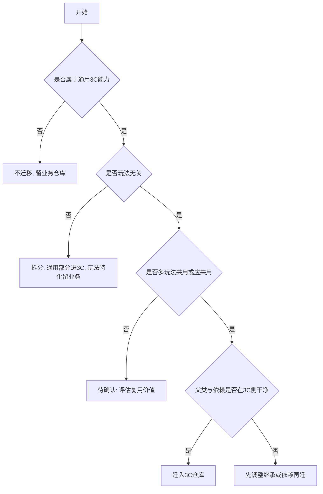

# Blueprint 类资产迁移至通用3C仓库——全景分析文档规范

> **文档类型**：工程级分析规范
> **适用范围**：UE `Blueprint`（含 Widget / Actor / Component / AnimBP 等）迁移至通用3C仓库的分析
> **版本**：v2.0
> **创建日期**：2026-05-07
>
> **定位**：当需要对一组 Blueprint 资产进行3C仓库迁移分析时，Markdown 分析文档须遵循本文档与上级 [SKILL.md](SKILL.md) 的结构与原则。

---

## 排版要求

- 文档标题使用 `#`，章节使用 `##`，子章节按 `###` → `####` → `#####` 递进
- **每个 `##` 和 `###` 章节之间用 `---` 水平线分隔**，增加视觉层次感
- **每个 `#####` 小节之间也用 `---` 分隔**，避免内容拥挤
- 表格路径过长时使用 `...` 省略公共前缀
- 2.1 总览表列数较多时，可拆为上下两行表格（基础信息 + 判断结论），保持可读性
- 段落间保持适当空行，避免文字紧贴表格或代码块

---

## 输出文档结构（必须包含以下章节，且顺序不可变）

```markdown
# <BP名称> 3C仓库迁移方案分析

---

## 资产列表

---

## 一、背景

---

## 二、资源功能分析
  ### 2.1 分析结论总览
  ---
  ### 2.2 详细分析
    #### 2.2.x 每个 Blueprint 一个子章节
      ##### 1~7 小节（之间用 --- 分隔）

---

## 三、当前问题重新归纳

---

## 四、方案总结
```

---

## 「资产列表」章节

- 固定开头文字：`本次分析涉及的 Blueprint 资产如下。`
- 以有序列表列出用户提供的全部 UE 资产路径，每条用反引号包裹

---

## 「一、背景」章节

此章节内容**固定**，不得改写。直接输出：

```markdown
## 一、背景

- 为了实现各玩法在角色体验层面的能力复用与独立迭代，需要将通用的3C能力（Character/Camera/Control）及相关的战斗、技能、武器、动画等系统从业务仓库中拆分出来，形成独立的通用3C仓库。
- 通用3C仓库与 LetsGoSDK 仓库平级：SDK 负责基建框架（启动、登录、大厅、通用模块），3C仓库负责角色体验基座。各玩法 GameFeature 仓库可同时依赖两者。
- 进入3C仓库的资产必须是通用的、玩法无关的，不能包含特定玩法模式的逻辑或强依赖特定玩法的业务资产。各玩法应在自己仓库内通过继承或组合扩展3C基座能力，而非修改3C仓库本身。
- 同时需要兼容原有功能，且支持后续新玩法（例如 ProjectT）可以直接依赖3C仓库获得完整的角色体验基座，无需从主玩法仓库中拷贝或重复实现。
```

---

## 「二、资源功能分析」章节

### 2.1 分析结论总览

用表格汇总所有 Blueprint 的结论。当列数过多导致表格过宽时，**拆为两行表格**：

**第一行表格（基础信息）**：

| 对象 | 资产路径 | 蓝图类型 | 父类 |

**第二行表格（判断结论）**：

| 是否属于通用3C能力 | 是否包含业务逻辑 | 是否迁移 | 对接人 |

---

### 2.2 详细分析

对每个资产使用一节 `#### 2.2.x <资产名>`，x 从 1 递增。每节**必须**包含以下 **7** 个小节，**标题与顺序不可变**，使用 `#####` 标题级别，**小节之间用 `---` 水平线分隔**。

---

##### 1. 蓝图类型与继承关系

- 该 BP 的 **Native Parent** / **Blueprint 父类**
- **父类归属层级**：明确标注属于 `3C层` / `业务层` / `引擎层`
- **C++ 继承链**：用缩进树形结构展示
- **Lua 继承关系**（如有 UnLua 绑定）
- 已知子类
- Interface 实现
- 信息不足时写 `待确认`

---

##### 2. 组件构成分析

> 本节全面梳理 BP 身上挂载/管理的所有组件，帮助评估迁移时的"跟随范围"。

**需要覆盖的组件来源**（按优先级排列）：

1. **BP 自身 Components 面板添加的组件**（仅 Actor BP）：通过 `uasset_exports` 查找 SCS 节点获取
2. **从父级 BP 继承的组件**（仅 Actor BP）
3. **C++ 构造函数中 `CreateDefaultSubobject` 创建的默认子对象**
4. **运行时动态创建/挂载的组件**：Grep Lua / C++ 代码中的 `NewObject`、`AddComponentByClass` 等

**输出格式**：

| # | 组件名 | 组件类型 | 来源 | 归属层级 | 迁移跟随策略 |

**不同 BP 类型的特殊处理**：

- **Actor BP**：完整分析以上 4 种来源
- **Component BP**：重点分析 C++ 父类的子对象和运行时管理的子组件
- **Widget BP**：分析 Widget 树中引用的子 Widget 类型

---

##### 3. 本BP依赖了谁（出向依赖）

> 本节列出本 BP 引用/持有的所有外部依赖，统一用一张表格呈现。

**数据获取方式**：**必须**使用 `editor.get_asset_dependencies`（ue-editor-mcp）获取出向依赖列表。步骤：

1. 调用 `editor.get_asset_dependencies`，传入 `asset_path`（`/Game/...` 格式）、`include_script: true`
2. 返回结果中包含 `package_name`、`asset_name`、`asset_class`，直接填表
3. 如需确认 Details 面板中具体哪个属性持有引用，可补充 `uasset-analyzer` 的 `uasset_properties`（CDO，parse_values=true）

**输出格式**：

| # | 被依赖对象 | 类型 | 依赖方式 |

> Lua 层 `require` / `_MOE.xxx` 不是 UE 资产引用，不在本表记录。Lua 中 `UE4.LoadObject()` 属于运行时动态加载，对迁移有影响时在表后**备注**说明。

---

##### 4. 谁依赖了本BP（入向依赖）

> 本节列出所有在 UE 资产层面引用/持有本 BP 的外部资产，等效于 **UE Reference Viewer 的 Referencers 视图**。

**数据获取方式**：**必须**使用 `editor.get_asset_referencers`（ue-editor-mcp）查询入向引用。步骤：

1. 调用 `editor.get_asset_referencers`，传入 `asset_path`（`/Game/...` 格式）、`dependency_type: "all"`
2. 返回结果包含 `package_name`、`asset_name`、`asset_class`（`Blueprint` / `World` 等），区分 BP 引用和关卡引用
3. 补充 Grep 搜索 `AssetNameMapping.txt`、`DefaultGame.ini` 等配置文件
4. 结果**按模块分组**展示，区分 Blueprint 类引用和 World（关卡）类引用

**输出格式**：

| # | 引用方 | 资产类型 | 依赖方式 | 迁移影响 |

- **引用方**：引用本 BP 的资产路径或配置文件
- **资产类型**：`Blueprint` / `关卡` / `DataTable` / `配置文件` / `其他 uasset`
- **依赖方式**：`Components 面板挂载子组件` / `变量默认值引用` / `蓝图节点 Cast/SpawnActor` / `AssetNameMapping 注册` 等（可通过 `uasset_properties` 进一步确认具体属性）
- **迁移影响**：`必须同步改动` / `需更新引用路径` / `不受影响`

> **注意**：本节只记录 UE 资产级引用（.uasset 之间的引用）。代码层引用（Lua/C++）在第 5 小节单独分析。

---

##### 5. Lua 代码引用分析

> 本节分析 Lua 代码中对本 BP 的引用情况。

**数据获取方式**：运行 `scan_lua_refs.py` 脚本，扫描 `Content/LetsGo/Script/`、`Content/Feature/`、`Content/LetsGoSDK/Script/`。搜索关键词包括 BP 短名、C++ 类名、资产路径片段。

**脚本特性**：
- 自动检测 `Content` 根目录（从 cwd 向上查找），支持从任意项目层级打开
- 支持 `--threshold N`（默认 30）控制输出模式

**输出格式**（按引用数量自动分流）：

**引用数 ≤ 阈值**：输出完整表格

| # | Lua 文件 | 行号 | 引用方式 | 引用内容摘要 |

**引用数 > 阈值**：输出路径分布概览 + 硬耦合引用明细

| 目录 | 总引用 | 硬耦合 | 弱耦合 | 其他 |

随后仅列出**硬耦合引用明细**表格（实例名访问、字符串常量等），弱耦合引用不逐条展示。

**两种模式末尾均附耦合度汇总**：
- **硬耦合（实例名/字符串常量）**：N 处，迁移后需同步改动
- **弱耦合（基类类型查找）**：N 处，迁移不受影响
- **其他引用**：N 处，需逐条确认

---

##### 6. 使用范围

> 本节基于第 4、5 小节的完整入向依赖数据，综合判断本 BP 的使用范围。

- 单玩法 / 多玩法共用 / 全局3C基座
- 覆盖的玩法、模式、场景（从入向依赖中的引用方归属判断）
- 与通用3C能力的关系：纯3C基座 / 含玩法特化逻辑 / 纯业务
- 是否跨玩法通用

---

##### 7. 迁移判断

- **结论**：`迁移进3C仓库` / `不迁移，留业务仓库` / `废弃` / `待确认`
- **依据**（引用第 1–6 小节证据）
- **改造方向**（若需）
- **待确认问题**（逐条列出）

---

## 「三、当前问题重新归纳」章节

从所有 Blueprint 分析中抽象**共性问题**，每条用 `####` 级标题。常见问题类型：

1. 3C 逻辑耦合玩法规则
2. 父类跨仓导致依赖不清晰
3. 数据表强依赖业务配置
4. 硬引用特定玩法美术资产

每条下写简短说明与影响面。

---

## 「四、方案总结」章节

表格固定表头：

| 资产 | 结论 |

- **资产**：Blueprint 短名（反引号）
- **结论**：一句话总结迁移决策与关键改造方向

---

## 迁移判断参考决策树



文字版：

1. **是否属于通用3C能力**？否 → 不迁移，留业务仓库
2. **是否玩法无关**？否 → 拆分，通用部分进3C，特化部分留业务
3. **是否多玩法共用或应共用**？否 → 待确认，评估复用价值
4. **父类与依赖是否在3C侧干净**？否 → 先调整继承/依赖再迁
5. 全部通过 → **迁入3C仓库**
6. 无法确认 → **待确认** + 问题列表

---

## 分析要求

1. 必须基于**代码搜索**与**可证实的资产引用**；不得虚构引用关系
2. 必须区分**通用3C能力**与**业务逻辑**
3. 全文**中文**；各资产 2.2 结构必须完全一致，不得缺节
