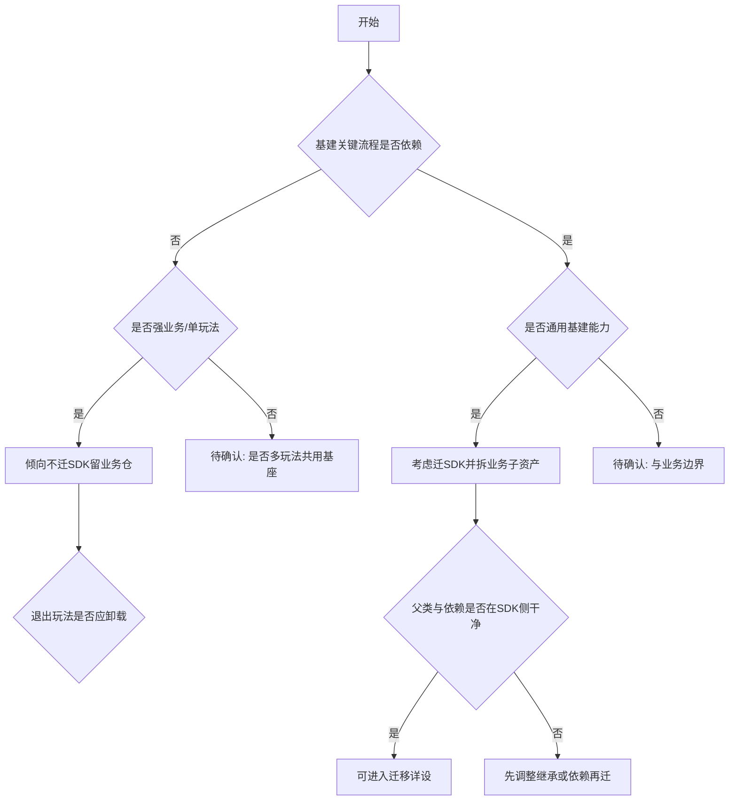

# Blueprint 类资产迁移方案全景分析文档规范

> **文档类型**：工程级分析规范  
> **适用范围**：UE `Blueprint`（含 Widget / Actor / Component / AnimBP 等）迁移分析  
> **版本**：v1.0  
> **创建日期**：2026-04-28
>
> **定位**：当需要对一组 Blueprint 资产进行迁移分析时，Markdown 分析文档须遵循本文档与上级 [SKILL.md](SKILL.md) 的结构与原则。  
> **与 DataTable 规范关系**：迁移目标、基建判断标准、「一、背景」固定文字与 [datatable-migration-analysis.md](../../CodingRules/datatable-migration-analysis.md) **一致**；资产形态不同，故 **2.1 表头**与 **2.2 小节**按 Blueprint 定制（7 个小节）。

---

## 输出文档结构（必须包含以下章节，且顺序不可变）

```markdown
## 资产列表
## 一、背景
## 二、资源功能分析
  ### 2.1 分析结论总览
  ### 2.2 详细分析
    #### 2.2.x 每个 Blueprint 一个子章节
## 三、当前问题重新归纳
## 四、方案总结
```

---

## 「资产列表」章节

- 固定开头文字：`本次分析涉及的 Blueprint 资产如下。`
- 以有序列表列出用户提供的全部 UE 资产路径，每条用反引号包裹

示例：

```markdown
## 资产列表

本次分析涉及的 Blueprint 资产如下。

说明：

1. `/Game/LetsGo/Blueprints/UI/WBP_Example1`
2. `/Game/LetsGo/Blueprints/Actor/BP_Example2`
```

---

## 「一、背景」章节

此章节内容**固定**，与 DataTable 迁移分析规范中的「一、背景」**逐字一致**，不得改写。直接输出：

```markdown
## 一、背景
- 为了实现彻底的副玩法隔离，各个仓库理论上只允许保留各玩法必须的DataTable，且只允许修改仓库内部的DataTable。
- 目前基建，启动登录以及一些通用模块的资产代码（包括DataTable）需要被移入SDK仓库，同时确保进入SDK仓库的内容一定是干净的，不能耦业务内容或依赖外部业务仓库。
- 同时需要兼容原有的功能，且支持后续新玩法（例如ProjectT）可以在自己仓库内维护自己DataTable（而非所有玩法维护修改一张总表）。

可以参考相关文档 ：
* https://iwiki.woa.com/p/4017337933 LiteFramework_需求拆分
* https://iwiki.woa.com/p/4017337926 02_工程结构设计
* https://iwiki.woa.com/p/4017339577 【置顶】LetsGoSDK资源&代码文件夹规范
```

> 说明：背景条文沿用 DataTable 规范原文；分析对象为 Blueprint 时，读者应将「副玩法隔离」「移入 SDK」「新玩法自维护」等量迁移目标**同等适用于 Blueprint 资产**。

---

## 「二、资源功能分析」章节

### 2.1 分析结论总览

用表格汇总所有 Blueprint 的结论，**列表头固定为**：

| 对象 | 资产路径 | 蓝图类型 | 父类 | 是否属于基建能力 | 是否包含业务逻辑 | 是否迁移 | 对接人 |

列含义：

- **对象**：Blueprint 资产短名（反引号包裹）
- **资产路径**：完整 `/Game/...` 路径
- **蓝图类型**：`Widget` / `Actor` / `ActorComponent` / `AnimBP` / `GameMode` / `Function Library` / `Macro Library` / `其他`
- **父类**：C++ 类名或父级 BP 路径；未知写 `待确认`
- **是否属于基建能力**：是否在「启动 → 登录 → 进入大厅」基建关键链路中被依赖；一句话理由
- **是否包含业务逻辑**：是否含特定玩法规则、模式分支，或强依赖业务侧子资产/业务代码；一句话理由
- **是否迁移**：四选一：`迁移进SDK` / `不迁移` / `废弃` / `待确认`；与 2.2 详细分析第 7 小节结论一致
- **对接人**：未知填 `待确认`

### 2.2 详细分析

对每个资产使用一节 `#### 2.2.x <资产名>`，x 从 1 递增。每节**必须**包含以下 **7** 个小节，**标题与顺序不可变**（使用 `#####` 标题级别）。

---

#### ##### 1. 蓝图类型与继承关系

- 该 BP 的 **Native Parent** / **Blueprint 父类**（C++ 或另一 BP 资产路径）
- 若存在 **Interface** 实现、**Mixin** 或代码生成基类，列出
- 本节点在工程中的**角色**（如：全屏界面、HUD 子部件、关卡机关 Actor 等）
- 信息不足时写 `待确认` 并说明需打开编辑器或查 `.uasset` 导出信息才能确认的内容

---

#### ##### 2. 组件构成与资产引用

分两部分：

**组件 / 图结构（高层）**

- **Widget**：主要 `Canvas` / `Overlay` 下关键子控件、列表、动画引用（能列则列）
- **Actor / Component**：`Scene` 组件树概要（根组件、关键子组件类型）
- **AnimBP**：关联的 `Skeleton` / `Mesh` 等（若可追踪）

**资产引用（依赖面）**

- 列出本 BP **直接持有**的其它 UE 资产：材质、网格、贴图、音效、粒子、其它 BP、DataTable 等（硬引用 / 软引用 / 字符串路径 / FSoftObjectPath 等能证实的来源）
- 若仅能确认「存在子资产依赖但列表待扫」，写 `待确认` 并建议 AssetRegistry 或 UE 引用查看器
- 若无（极少见），写明「未发现除默认外的显著子资产引用」

---

#### ##### 3. 使用方与关联关系

**谁在使用本 Blueprint**

- **Lua**：`AssetLoadUtils` / `AssetMgr` / `UserWidgetMgr:CreateWidget` / `UE4.Class("...")` 等；给出文件与函数级线索
- **C++**：`LoadClass` / `CreateWidget` / `SpawnActor` / 成员 `TSubclassOf` 等
- **其它 Blueprint / 关卡 / 数据表**：能搜到的引用方
- **世界中的放置实例**（若该 BP 主要作为关卡放置物）

**与哪些系统强耦合**

- `UIManager`、UI 配置、资源名映射、Chunk 配置等**硬编码路径**
- 与**其它 Blueprint** 的硬 `Cast`、或仅通过 `Interface` / 事件通信（评估解耦难度）

---

#### ##### 4. 当前加载链路与现状

- 用**编号列表**写清：从启动/入口到本 BP 被加载/实例化的大致调用链（能追到的最细粒度）
- 单独描述**运行时使用链**（如：打开某界面后如何反复 Show/Hide、子系统如何持有引用）
- 总结加载特征：`启动预加载` / `首进大厅拉取` / `进玩法才异步加载` / `随关卡流送` 等
- 描述 **Blueprint 层通信习惯**：`EventDispatcher`、接口消息、`Cast` 到具体类、仅数据绑定等
- 列出**待确认点**（如：是否已废弃、是否空壳 BP、是否仅编辑器测试用）

---

#### ##### 5. 生命周期

**当前生命周期**

- 实际创建/销毁时机、由谁持有 `UObject` 引用、是否随玩法/关卡退出而释放

**理想生命周期**（从 SDK 隔离与副玩法独立角度）

- 若迁入 SDK 或保留在业务仓，**应**在何时加载/卸载，如何与「当前玩法」对齐

---

#### ##### 6. 使用范围

- 单玩法 / 多玩法共用 / 全局基建
- 如可列举：当前覆盖的玩法、模式、场景
- 与**基建关键流程**的关系：无接触 / 间接 / 强依赖

---

#### ##### 7. 迁移判断

- 结论四选一或组合说明：**迁移进 SDK** / **不迁移，留业务仓库** / **废弃** / **待确认**
- **依据**（对应第 1–6 小节的证据）
- **改造方向**（若需）：路径配置化、基类上提、Interface 化、按玩法分包加载、拆出业务子 BP 等
- 存在分歧或信息缺口时，**逐条**列出待确认问题

---

## 「三、当前问题重新归纳」章节

从所有 Blueprint 分析中抽象**共性问题**，每条用 `####` 级标题。Blueprint 场景下常包括（不限于）：

1. 固定路径引用 LetsGo 侧通用 Blueprint / 资源映射，导致新玩法仓库无法独立打包或运行
2. 启动期或进大厅前预加载大量**业务向** Widget/Actor，未按玩法生命周期切分
3. 父类或强依赖类型留在业务仓，却要求 BP 本身进 SDK，**继承与依赖方向**冲突
4. 强 `Cast` 与硬引用链路过长，**Interface/事件** 改造前迁移风险高
5. 与 DataTable 规范中第 3 类问题同构：**新玩法**（如 ProjectT）在自有 Content 下无法复用或找不到原 `/Game/LetsGo/...` 资产

每条下可写简短说明与影响面。

---

## 「四、方案总结」章节

表格**列表头固定**：

| 资产 | 结论 |

- **资产**：Blueprint 短名（反引号）
- **结论**：如 `资产迁移进SDK，父类与接口需同步评估`、`资产不迁移，UIManager 注册表与路径需改造`、`废弃，无需迁移`、`待确认：需主程确认基类归属` 等

---

## 迁移判断参考决策树

下列逻辑与 DataTable 规范原则一致，并补充 Blueprint 特有点：



文字版（与上图一致，便于无 Mermaid 环境使用）：

1. **基建关键流程是否依赖**？否 → 倾向**不迁 SDK**；是 → 继续。  
2. 是否属**通用基建**（多玩法、无模式分支）？是 → **考虑迁 SDK**；否 → **待确认**或按业务处理。  
3. **父类、Interface、子资产**是否跨仓耦合？是 → 先列**拆分/上提/接口化**再谈搬迁。  
4. **无法确认**时输出 **待确认** 与问题列表，不强行结论。

---

## 分析要求（与 DataTable 一致部分）

1. 必须基于**代码搜索**与**可证实的资产引用**；不得虚构引用关系。  
2. 必须区分**基建**与**业务**；核心标准：**启动 → 登录 → 进入大厅**链路。  
3. 全文**中文**；各资产**2.2 结构必须完全一致**，不得缺节。

---

## 与 DataTable 详细规范的对照

| 维度 | DataTable 规范 | Blueprint 本规范 |
|------|----------------|------------------|
| 资产列表抬头 | DataTable / 表类 | Blueprint 资产 |
| 2.1 表头 | 类型定位、基建配置、业务配置 | 蓝图类型、父类、基建能力、业务逻辑、是否迁移 |
| 2.2 小节数 | 6 | 7（增加组件与引用；加载与通信合并进第 4 节） |
| 背景与迁移原则 | 相同 | 相同 |

DataTable 专用全文见 [datatable-migration-analysis.md](../../CodingRules/datatable-migration-analysis.md)。
